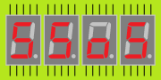

# Seven Segment over Serial (SSoS)
A device consisting of 7-segment display units, controllable via a serial link (with Arduino sketch and LEGO enclosure).

## Introduction
I stumbled on this module [Seven Segment for micro:bit](http://www.monkmakes.com/mb_7_seg.html).
I immediately thought that such a thing would be a nice external display for the new LEGO Mindstorms Robot Inventor - it
does not have a display - at least not one that can display bigger numbers. But I want it smaller to better fit LEGO.

Later I found that [sparkfun](https://learn.sparkfun.com/tutorials/using-the-serial-7-segment-display/all) has something similar.

## Font
There is a [python script](font) to generate font tables.

## Electronics
Design of the [electronics](electronics) (PCB).

## ISR model
Modeling the [interrupt service routine (ISR)](isr).
The model is made in Python, but in the end, the ISR is the central part of the ATmega firmware, driving the 7-segments.
The ISR needs to support brightness control and blinking.

## Firmware
The [firmware](firmware) for the Arduino Nano, the controller on the SSoS board.
First some proof of concept sketches, finally the "end-product".

## Enclosure 
todo

(end)
