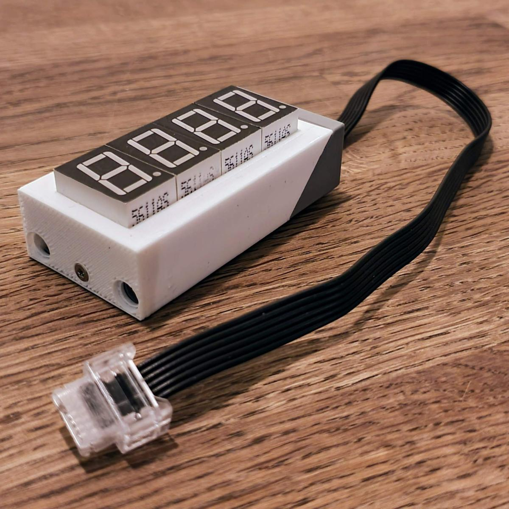
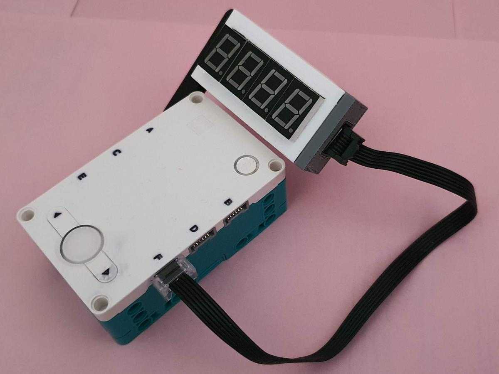

# Seven Segment over Serial (SSoS)
A device consisting of 7-segment display units, controllable via a serial link (with Arduino sketch and LEGO enclosure).

See a [video](https://youtu.be/2fTZVQPiG7E) of the device in action.

## Introduction
I stumbled on this module [Seven Segment for micro:bit](http://www.monkmakes.com/mb_7_seg.html).
I immediately thought that such a thing would be a nice external display for the new LEGO Mindstorms Robot Inventor - it
does not have a display - at least not one that can display bigger numbers. But I want it smaller to better fit LEGO.

Later I found that [sparkfun](https://learn.sparkfun.com/tutorials/using-the-serial-7-segment-display/all) has something similar.
This board is also a bit too wide to my liking, and _retired_.

## Font
There is a [python script](font) to generate font tables. 
I designed two fonts, one _LookAlike7s_ with characters that are as close as possible to the real thing.
The second font _Unique7s_ maps each character to a unique pattern on the 7-segment display.

## Electronics
Design of the [electronics](electronics): the power architecture, display control, wiring (used pins), schematics, and finally PCB with IDC socket.
My project on EasyEDA is [public](https://oshwlab.com/maartenpennings/ssos).

## ISR model
Modeling the [interrupt service routine (ISR)](isr). The ISR needs to support brightness control and blinking.
The model is made in Python, but in the end, the ISR is the central part of the ATmega firmware, driving the 7-segments.

## Firmware
The [firmware](firmware) for the Arduino Nano, the controller on the SSoS board.
First some proof of concept sketches (using SFRs for ports, timer, ISR), finally the [end-product](firmware/SSoS).

## User manual
There is an extensive [user manual](manual) with examples (as implemented by the firmware for the [end-product](firmware/SSoS)).

## LEGO enclosure 
I 3D-printed an [enclosure](enclosure) so that I can use SSoS with LEGO Mindstorms.

## LEGO demo
See the [LEGO code](legocode) for some examples of how to use the SSoS device with LEGO.

(end)
