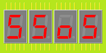

# Seven Segment over Serial (SSoS)
A device consisting of 7-segment display units, controllable via a serial link (with Arduino sketch and LEGO enclosure).

## Font
There is a [python script](font) to generate font tables.

## Electronics
Studying how to design the [electronics](electronics).

(end)
