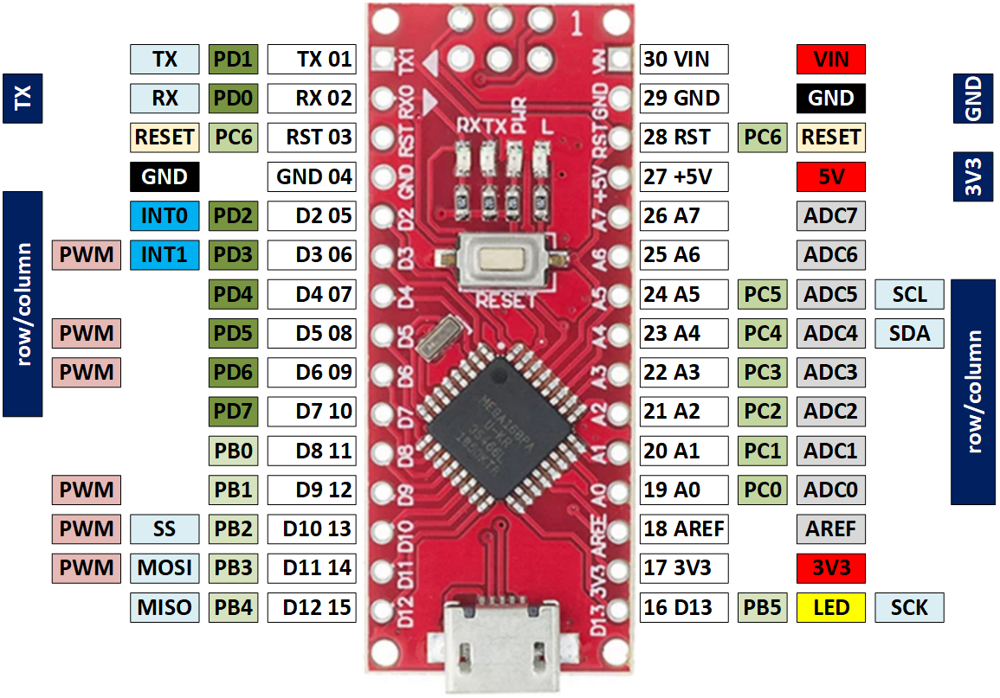

# Electronics

Electronic design of the s4x7s board.

## Arduino Nano power architecture

The Nano can be powered via
 - the `USB` connector;
 - 6 to 20V unregulated external power supply (pin 30, `VIN`); 
 - 5V regulated external power supply (pin 27, `+5V`).

Note that
 - the `+3V3` (pin 17) is a low-current output supplied by the CH340;
 - the `+5V` (pin 27) can be used as output, provided the Nano is powered via `USB` or `VIN`;
 - `VUSB` is not pinned out;
 - the "power" LED is connected to the internal 5V rail;
 - a diode protects a USB host in case the Nano is inadvertently connected via `USB` and `+5V`;
 - according to the datasheet the operating voltage is 2.7V-5.5V for Atmel ATmega48/88/168.

**Conclusion**
We power the board by connecting pin 27 (`+5V`) to the external host.
The external host has a voltage of 3V3.

## Display control

According to the ATmega48/88/168 datasheet:
 - each I/O port can **source** more than the test conditions (20mA at VCC = 5V, **10mA** at VCC = 3V)
 - the sum of all IOH, for ports C0 - C5, D0- D4, ADC7, RESET should not exceed 150mA.
 - the sum of all IOH, for ports B0 - B5, D5 - D7, ADC6, XTAL1, XTAL2 should not exceed 150mA.

Similarly,
 - each I/O port can **sink** more than the test conditions (20mA at VCC = 5V, **10mA** at VCC = 3V)
 - the sum of all IOL, for ports C0 - C5, ADC7, ADC6 should not exceed 100mA.
 - the sum of all IOL, for ports B0 - B5, D5 - D7, XTAL1, XTAL2 should not exceed 100mA.
 - the sum of all IOL, for ports D0 - D4, RESET should not exceed 100mA.

So, sourcing 8 LEDs via 8 output pins is fine, as long as each LED gets 10mA max.

Sinking 8 LEDs via 1 output port is **not** ok, that would be 80mA where the max is 10mA.

**Conclusion**
We connect the four 7-segment displays in a row/column fashion. 
The individual segments ("columns") can be hooked directly to an output pin of the ATmega, provided that the current limiting resistor limits the LED current and thus the sourcing via the pin to 10mA.
The commons of the display ("rows"), need to sink, worst case, all 8 LEDs of the display. As a result, we use a transistor.

## Wiring

We will use the pins as marked in the dark blue bars. 
Note that we have 6+6 row/column pins, which will be used to drive 8 columns and 4 rows.
We tried to group these in so-called ports so that a single SFR assignment suffices.

## References 

 - [Arduino Nano description](https://www.arduino.cc/en/pmwiki.php?n=Main/ArduinoBoardNano)
 - [Arduino Nano schematics](https://www.arduino.cc/en/uploads/Main/ArduinoNano30Schematic.pdf)
 - [ATmega168 information (and datasheet)](https://www.microchip.com/en-us/product/ATmega168)

(end)
