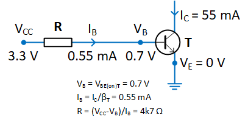

# Electronics

Electronic design of the SSoS board.

## Arduino Nano power architecture

The Nano can be powered via
 - the `USB` connector;
 - 6 to 20V _unregulated_ external power supply (pin 30, `VIN`) - it is regulated internally (by V-reg); 
 - 5V _regulated_ external power supply (pin 27, `+5V`).

Note that
 - the `+3V3` (pin 17) is a low-current output supplied by the CH340;
 - the `+5V` (pin 27) can be used as output, provided the Nano is powered via `USB` or `VIN`;
 - `VUSB` is not pinned out;
 - the "power" LED is connected to the internal 5V rail;
 - a diode protects a USB host in case the Nano is inadvertently connected via `USB` and `+5V`;
 - according to the datasheet the operating voltage is 2.7V-5.5V for Atmel ATmega48/88/168.
 - this means that we can use pin 27 `+5V` also as input, provided weer attach a _regulated_ power in the range 2.7V-5.5V.

**Conclusion**
We power the board by connecting pin 27 (`+5V`) to the external host.
This is fine as long as the external host a "standard" regulated voltage (e.g. 3V3 or 5V). 
It also means that the logic pins, e.g. the incoming `RX` will have the host level.

## Display control

According to the ATmega48/88/168 datasheet:
 - each I/O port can **source** more than the test conditions (20mA at VCC = 5V, **10mA** at VCC = 3V)
 - the sum of all IOH, for ports C0 - C5, D0- D4, ADC7, RESET should not exceed 150mA.
 - the sum of all IOH, for ports B0 - B5, D5 - D7, ADC6, XTAL1, XTAL2 should not exceed 150mA.

Similarly,
 - each I/O port can **sink** more than the test conditions (20mA at VCC = 5V, **10mA** at VCC = 3V)
 - the sum of all IOL, for ports C0 - C5, ADC7, ADC6 should not exceed 100mA.
 - the sum of all IOL, for ports B0 - B5, D5 - D7, XTAL1, XTAL2 should not exceed 100mA.
 - the sum of all IOL, for ports D0 - D4, RESET should not exceed 100mA.

So, sourcing 8 LEDs via 8 output pins is fine, as long as each LED gets 10mA max.

Sinking 8 LEDs via 1 output port is **not** ok, that would be 80mA where the max is 10mA.

**Conclusion**
We connect the four 7-segment displays in a row/column fashion. 
The individual segments ("rows") can be hooked directly to an output pin of the ATmega, provided that the current limiting resistor limits the LED current and thus the sourcing via the pin to 10mA.
The commons of the display ("columns"), need to sink, worst case, all 8 LED segments of a display unit. As a result, we use a transistor.
The principle is depicted below, for the real schematic see section below.

I decided to have current limiting resistors of 220 ohm.
Red LEDs have a forward voltage of Vf=1.8. 
With an external voltage of 3V3, the resistor drops 1.5V, leading to a current of 6.8mA for one segment and 55mA for all 8.
With an external voltage of 5V0, the resistor drops 3.2V, leading to a current of 14.5mA for one segment and 116mA for all 8.

| VCC | V_R (V)| I_R (mA) R=220Ω | I_common (mA) 8 LEDs |
|----:|-------:|----------------:|---------------------:|
| 3.3 |    1.5 |             6.8 |                   55 |
| 5.0 |    3.2 |            14.5 |                  116 |

I'm not completely sure about the dimension of the base resistor.

If we assume I_C to be 55mA, and the gain (hFE, beta?) to be 100, then I_B is only 55mA/100 or 0.55mA.
There is a voltage drop across BE in the transistor, which is typically V_BE=0.7V. The emitter is grounded so V_B=0.7V.
The Arduino GPIO pin outputs VCC=3.3V, so we need a voltage drop over the base resistor from 3.3V to 0.7V or 2.6V.
With Ohm's law we find R = V_R/I_R = 2.6 / 0.55m = 4k7Ω.

| VCC | I_C (mA) | I_B (mA) β=100 | V_R (V) VCC-V_B | R (Ω) V_R/I_B) |
|----:|---------:|---------------:|----------------:|---------------:|
| 3.3 |       55 |           0.55 |            2.6  |           4727 |
| 5.0 |      116 |           1.16 |            4.3  |           3706 |

So, 2k2 seems save to make sure the transistor is saturated...

## Wiring

We will use the pins as marked in the dark blue bars. 
Note that we have 6+6 row/column pins, which will be used to drive 8 columns and 4 rows.
We tried to group these in so-called ports so that a single SFR assignment suffices.

The breadboard prototype works, but the LEGO mindstorms 3V3 is on the edge.

## PCB production.

I used [EasyEda](https://easyeda.com) to design a PCB.
First step was to make [schematics](Schematic_SSoS.pdf).

I intend to use SSoS for LEGO Mindstorms.
The output voltage is a bit low, so I decided to reserve room for a [boost converter](https://www.aliexpress.com/item/32762622485.html):
 - Host has regulated power in the range of 3-6V: connect Vreg/GND/SER of J1.
 - Otherwise mount buck or boost regulator on J2 and connect Vunr/GND/SER of J1

Next comes layout.

The final step is to generate the [gerber](Gerber_SSoS.zip) file.
I sent those to [JLCPCB](https://jlcpcb.com/).
Five PCBs for €1.77 plus €3.84 shipping (3 weeks).

## References 

 - [Arduino Nano description](https://www.arduino.cc/en/pmwiki.php?n=Main/ArduinoBoardNano)
 - [Arduino Nano schematics](https://www.arduino.cc/en/uploads/Main/ArduinoNano30Schematic.pdf)
 - [ATmega168 information (and datasheet)](https://www.microchip.com/en-us/product/ATmega168)

(end)
