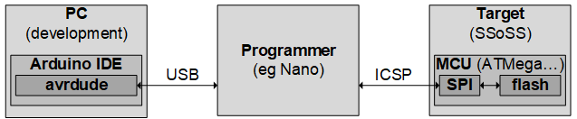

# Flashing the SSoSS

This page describes how to program the SSoSS board - that is not trivial, because the mounted ATmega328PB has no bootloader.


## Introduction

The board that came back from [JLCPCB](https://jlcpcb.com/DMP) has an ATmega328PB straight from the factory.
In other words, it does _not_ have a bootloader.
That is the reason I added an [ICSP](https://en.wikipedia.org/wiki/In-system_programming) (In-Circuit Serial Programming) header to the board.
It allows low-level access to the flash.

We need a so-called _programmer_ to connect a PC to the board to program the ATmega328PB.

You can buy a programmer, but you can also convert an Arduino Nano (or Uno) into a programmer, 
see https://www.instructables.com/Burn-a-New-Bootloader-Arduino-Pro-Mini. The latter is what we are going to do.
This allows us, to use `avrdude` on the PC to "mess around" in the _target_.
The tool avrdude is actually integrated in the Arduino IDE, so you are using it without knowing it.



This messing around could be: flashing your own application, set internal fuses, or flashing a bootloader.

Flashing the application is what we are after.

You might wonder what the fuses are. Those are bits in some non-volatile memory that 
[configure features in the MCU](https://circuitdigest.com/microcontroller-projects/understanding-fuse-bits-in-atmega328p-to-enhance-arduino-programming-skills).

We can also flash a bootloader (in the lower part of the flash). 
With that, we no longer need a programmer; a USB-to-serial adapter suffices.
Avrdude sends commands via the serial port to the bootloader running on the target, 
those commands flash the user application in the (upper part of the) flash.

This is what most Arduino boards (Uno, Nano) use.


## Making an ICSP programmer

First we need a _programmer_. 

We will convert a standard Arduino Nano to a programmer by flashing an appropriate piece of firmware.

 - Connect the Nano (the programmer to be) to the PC (using USB).
 - Open the Arduino IDE (I'm using 1.8.13, May 2022).
 - In the Tools menu make sure
   - `Board` is `Nano` (`Tools -> Board -> Arduino AVR Boards > Arduino Nano`) - an Uno would also work if you have that.
   - `Processor` is `ATmega328P (Old Bootloader)` - maybe yours has the new bootloader.
   - `Port` is `COM5` - or whatever the USB port of your Nano is.
 - Load the programmer sketch: `File -> Examples -> 11.ArduinoISP -> ArduinoISP`.
 - Compile and upload the programmer sketch by pressing the Upload button (or `Sketch > Upload`).

The Nano is now a programmer.


## Wiring the programmer to a target
Secondly, we need to wire the programmer (the Nano) to the target board, in our case the SSoSS board.
The connection basically consists of connecting the ICSP headers one-to-one, RESET being the exception.

Connect
 - VCC:   Nano-programmer.VCC to target-SSoSS.VCC
 - GND:   Nano-programmer.GND to target-SSoSS.GND
 - MOSI:  Nano-programmer.D11 to target-SSoSS.D11
 - MISO:  Nano-programmer.D12 to target-SSoSS.D12
 - SCK:   Nano-programmer.D13 to target-SSoSS.D13
 - RESET: Nano-programmer.**D10** to target-SSoSS.**RSTn**


This is the pinout of the ICSP header (the dot in the lower right corner, of both boards, indicates pin 1).

```text
            +----+
        GND |6  5| RSTn
 MOSI (D11) |4  3| SCK (D13)
        VCC |2  1| MISO (D12)
            +----+°
```         


## Flashing

Thirdly, with the programmer connected to the target, we can flash the target.
There are two options:
 - Use the programmer to flash a **bootloader** to the target. 
 - Use the programmer to flash an **application** to the target.


### Flashing the bootloader using Arduino IDE

We can use the programmer to flash a bootloader.
We can even do that from the Arduino IDE; I believe this also programs the fuses.

It is important that the IDE knows the target MCU, so it can flash the appropriate bootloader using the correct method.
 - We have the target board (SSoSS) connected with the 6 wires to the programmer (Nano) as described above.
 - We connect the Nano to the PC.
 - On the PC we start the Arduino IDE with an empty project.
 - We must setup the correct target in te Tools menu.
   - `Board` is `Arduino Pro or Pro Mini` - this is the board closest to the SSoSS.
   - `Processor` is `ATmega328P (3.3V, 8MHz)` - the board has an 8MHz oscillator and will run on 3V3 (although now it runs on 5V).
   - `Port` is the port the programmer is connected to (`COM5` in my example)
   - `Programmer` must be set `Arduino as ISP` - that is what we just flashed in the Nano.

Now, do not make the mistake to press Upload, that will compile and flash the current (empty?) project
to the Nano. Instead, we select `Tools > Burn Bootloader`.


I suggest that before you fire up the burning, you select
`File > Preferences > Show verbose output during: > upload`. 
Then this is the result.

```txt
C:\Users\maarten\AppData\Local\Arduino15\packages\arduino\tools\avrdude\6.3.0-arduino17/bin/avrdude -CC:\Users\maarten\AppData\Local\Arduino15\packages\arduino\tools\avrdude\6.3.0-arduino17/etc/avrdude.conf -v -patmega328p -cstk500v1 -PCOM5 -b19200 -e -Ulock:w:0x3F:m -Uefuse:w:0xFD:m -Uhfuse:w:0xDA:m -Ulfuse:w:0xFF:m 

avrdude: Version 6.3-20190619
         Copyright (c) 2000-2005 Brian Dean, http://www.bdmicro.com/
         Copyright (c) 2007-2014 Joerg Wunsch

         System wide configuration file is "C:\Users\maarten\AppData\Local\Arduino15\packages\arduino\tools\avrdude\6.3.0-arduino17/etc/avrdude.conf"

         Using Port                    : COM5
         Using Programmer              : stk500v1
         Overriding Baud Rate          : 19200
         AVR Part                      : ATmega328P
         Chip Erase delay              : 9000 us
         PAGEL                         : PD7
         BS2                           : PC2
         RESET disposition             : dedicated
         RETRY pulse                   : SCK
         serial program mode           : yes
         parallel program mode         : yes
         Timeout                       : 200
         StabDelay                     : 100
         CmdexeDelay                   : 25
         SyncLoops                     : 32
         ByteDelay                     : 0
         PollIndex                     : 3
         PollValue                     : 0x53
         Memory Detail                 :

                                  Block Poll               Page                       Polled
           Memory Type Mode Delay Size  Indx Paged  Size   Size #Pages MinW  MaxW   ReadBack
           ----------- ---- ----- ----- ---- ------ ------ ---- ------ ----- ----- ---------
           eeprom        65    20     4    0 no       1024    4      0  3600  3600 0xff 0xff
           flash         65     6   128    0 yes     32768  128    256  4500  4500 0xff 0xff
           lfuse          0     0     0    0 no          1    0      0  4500  4500 0x00 0x00
           hfuse          0     0     0    0 no          1    0      0  4500  4500 0x00 0x00
           efuse          0     0     0    0 no          1    0      0  4500  4500 0x00 0x00
           lock           0     0     0    0 no          1    0      0  4500  4500 0x00 0x00
           calibration    0     0     0    0 no          1    0      0     0     0 0x00 0x00
           signature      0     0     0    0 no          3    0      0     0     0 0x00 0x00

         Programmer Type : STK500
         Description     : Atmel STK500 Version 1.x firmware
         Hardware Version: 2
         Firmware Version: 1.18
         Topcard         : Unknown
         Vtarget         : 0.0 V
         Varef           : 0.0 V
         Oscillator      : Off
         SCK period      : 0.1 us

avrdude: AVR device initialized and ready to accept instructions

Reading | ################################################## | 100% 0.04s

avrdude: Device signature = 0x1e9516 (probably m328pb)
avrdude: Expected signature for ATmega328P is 1E 95 0F
         Double check chip, or use -F to override this check.

avrdude done.  Thank you.

Error while burning bootloader.
```

Normally, this would work. Unfortunately, we get an error.
The error is at the end: `Device signature = 0x1e9516 (probably m328pb), Expected signature for ATmega328P is 1E 95 0F`.
Damn, I put a non-standard ATmega328 on the SSoSS, the PB variant instead of the B variant.

The reason I did this, was that the B variant was not available at LCSC, but the PB variant was.
I did check the differences of [ATmega328PB vs ATmega328P](https://onlinedocs.microchip.com/pr/GUID-CBDC1838-0100-4F26-A45A-134958193C3B-en-US-4/index.html)

> ATmega328PB is not a drop-in replacement for ATmega328 variants, but a new device. 
> However, the functions are backward compatible with the existing ATmega328 functions. 
> Existing code for these devices will work in the new devices without changing existing configuration or enabling new functions. 
> The code that is available for your existing ATmega328 variants will continue to work on the new ATmega328PB device.

My conclusion back when I selected it: slightly different footprint, but software-wise backward compatible.
Now I know that the Arduino IDE can't burn the bootloader.

But maybe avrdude can...

> **Note** the core problem is that no Arduino board has the ATMega328PB.
> I did find an Arduino IDE compatible board from [polulu](https://www.pololu.com/docs/0J74/4.3).
> However, it turned out that it is not well enough integrated to make the `Burn bootloader` work.

So let's try avrdude.


### Flashing the bootloader using avrdude

The very first line of the upload in the console is as follows (I added line breaks for readability).
```
  C:\Users\maarten\AppData\Local\Arduino15\packages\arduino\tools\avrdude\6.3.0-arduino17/bin/avrdude 
      -CC:\Users\maarten\AppData\Local\Arduino15\packages\arduino\tools\avrdude\6.3.0-arduino17/etc/avrdude.conf
      -v -patmega328p -cstk500v1 -PCOM5 -b19200 -e 
      -Ulock:w:0x3F:m -Uefuse:w:0xFD:m -Uhfuse:w:0xDA:m -Ulfuse:w:0xFF:m 
```

Let's check the [avrdude manual](https://man.archlinux.org/man/community/avrdude/avrdude.1.en)
(or [adafruit](https://www.ladyada.net/learn/avr/avrdude.html)).
We learn
 - `avrdude` executable is located in `C:\Users\maarten\AppData\Local\Arduino15\packages\arduino\tools\avrdude\6.3.0-arduino17\bin`.
 - The `-C` passes a config-file that contains all programmer and part definitions that avrdude knows about. 
 - `-v` to enable verbose output.
 - `-p partno` is the only option that is mandatory, we see that `atmega328p` is passed instead of `patmega328pb`.  
   This is the **root cuase of the error**.
 - `-c programmer-id`; Atmel's default programmer is the STK500 programmer, and that seems the one being used (in the Nano presumably).
 - `P port` to identify the serial port to which the programmer is attached.
 - `-b baudrate`, bit confusing, we are using SPI, not RS-232 that the avrdude manual mentions.
 - `-e` causes a chip erase to be executed. This is a relevant observation: 
   the entire flash is erased, including any bootloader that might be already there.

Next come the important parameter, the `U`s, to write to non-volatile memories.
Here the `U`s write the fuses. 
 - There are four of them `lock`, `efuse`, `hfuse`, and `lfuse`.
   The avrdude manual explains: lock is the lock byte, efuse is the extended fuse byte, hfuse is the high fuse byte, lfuse is the low fuse byte.
 - The argument of `U` is `memtype:op:data:format`
   - `memtype` is either `flash` or `eeprom`, or `lock`, `hfuse`, `lfuse`, or `efuse`, ...
   - after the `:` comes `op`: `r`, `w`, or `v` meaning you can use r (read), w (write), or v (verify).
   - after the next `:` comes data, an inline value or a filename.
   - a final `:` gives the format, important is `m` for immediate (inline) value, or `i` for intel hex encoded file.

**Conclusion**: "flashing the bootloader" does not flash the bootloader, it just flashes the fuses. 

Let's check what the IDE tried to write to the fuses.

One explanation is on this [page](https://circuitdigest.com/microcontroller-projects/understanding-fuse-bits-in-atmega328p-to-enhance-arduino-programming-skills).
However, it is for the ATMega328P, so also check the [ATMega328PB datasheet](https://ww1.microchip.com/downloads/en/DeviceDoc/40001906C.pdf)
(do not use the old 2017 revision A datasheet, but at least the 2018 revision C datasheet).

**Please note that one aspect is rather confusing for fuses**: a 1 in a fuse bit is referred to as "unprogrammed". In other words, fuse bits are "low-active".

 - lock to 0x3F or `0011 1111`  
 
   

   The ATmega328PB uses the lower 6 bits only. 
   Writing a 0 in one of those 6 activates some lock such as "programming of the Flash and EEPROM is disabled".
   I don't want or need to lock my firmware - it's on github :-) anyhow.
   
   The value 0b0011_1111 or 0x3F makes sense for the lock byte.
   
 - efuse to 0xFD or `1111 1101`  
 
   

   The "Extended Fuse" byte has two bit-fields:
   
   - bit 3 set to `1` - `CFD` (disable Clock Failure detection). This is "new", i.e. not in ATmega328P.  By default this is 0, programmed, disabled, but the command would enable it.
   - bit 2,1,0 set to `101` - `BODLEVEL` (Brown-Out LEVEL). The command sets BODLEVEL to `101` meaning 2.5V .. 2.9V, which sounds good for an 3V3 supply.
     
   
   I think I want 0b1111_0101 or 0xF5 for the efuse (also disable CFD).
   
 - hfuse to 0xDA or `1101 1010`  
 
   
   
   The "High Fuse" byte has 7 bit fields:
   
   - bit   7 set to `1` - `RSTDISBL` (external ReSeT DISabLe) 
     disables the external hardware reset pin. 
     1 means `unprogrammed` (disable not active, so reset enabled). 
     **Writing 0 can brick your device.**
     
   - bit   6 set to `1` - `DWEN` (Debug Wire ENable) 
     HW feature used to program/debug with a single wire; you will need special hardware.  
     1 means `unprogrammed` (so not enabled).
     
   - bit   5 set to `0` - `SPIEN` (SPI ENable) 
     enables the SPI programming interface. This is what we use over ICSP. 
     0 means programmed, i.e. SPI enabled. 
     **Writing 1 can brick your device.**
     
   - bit   4 set to `1` - `WDTON` (Watch Dog ON) 
     enables the watchdog. 
     1 means `unprogrammed` (no watchdog).
     
   - bit   3 set to `1` - `EESAVE` (EEprom SAVE) 
     the EEPROM memory is preserved through chip erase. 
     1 means `unprogrammed` (EEPROM also erased).
     
   - bit 2,1 set to `01` - `BOOTSZ` (BOOT SiZe) 
     refers to the amount of memory reserved for the bootloader. 
     The command writes `01` to have 16 pages of 64 words or 1024 words (2048 bytes) for the bootloader. 
     Default is `00` which is **bigger**: 2048 words (4096 bytes).
     
     
     
   - bit   0 set to `0` - `BOOTRST` (BOOT ReSeT vector). 
     The Reset vector can be moved to the start of the boot Flash section by programming the BOOTRST Fuse. 
     The command writes `0`, i.e. using the bootloader area.
     
     
   
   I think I want 0b1101_1110 or 0xDE for the hfuse (smallest space for bootloader).
   
 - lfuse to 0xFF or `1111 1111`  
 
   
 
   The "Low Fuse" byte has four fields:
   
   - bit    7 set to `1` - CKDIV8 (ClocK DIVide by 8). 
     1 means `unprogrammed`, so not divided by 8.
     
   - bit    6 set to `1` - CKOUT (ClocK OUTput) 
     allows the system clock to be output on PORTB0, I guess for checking the system. 
     1 means `unprogrammed` (not output).
     
   - bit   54 set to `11` - SUT (Start-Up Time).
     I believe it makes sense that bit 0/CKSEL0 is prepended to SUT.
   
     
     
     Looking at the three bits CKSEL0/SUT1/SUT0, the command sets them to `111`.
     This configuration results in maximum start-up time 16k plus 19k clock cycles plus 65ms.
     For an 8MHz clock, 35k cycles is 4.5ms, so total delay is just below 70ms. 
     Looks safe and not unusable long.
     And we do have an external oscillator who presumably need some time to settle. 
     
   - bit 3210 set to `1111` - CKSEL (ClocK source SELect). 
   
     The default of 0010 for CKSEL[3:0] results in internal RC Oscillator at 8 MHz as seen in the following table
     
     
     
     The command tries to write 1111; this means "Low Power Crystal Oscillator", and that sounds good.

   I think I'm happy with the 0b1111_1111 or 0xFF for the lfuse.

Summarizing, the command tried to write
 - lock to 0x3F or `0011 1111` and I agree on `xx11 1111`.
 - efuse to 0xFD or `1111 1101` but I prefer `1111 0101` or 0xF5 (also disable CFD).
 - hfuse to 0xDA or `1101 1010` but I prefer `1101 1110` or 0xDE (smallest space for bootloader).
 - lfuse to 0xFF or `1111 1111` and I agree.


The write command failed.
However, as we see later, I do have the fuses at the values I want, not sure why.

```
avrdude: safemode: lfuse reads as FF
avrdude: safemode: hfuse reads as DE
avrdude: safemode: efuse reads as F5
```

We do not need to burn the bootlader (or the fuse bits), we can also directly flash the application.


### Flashing the application using avrdude

The Tools menu shows how the compiler should build (`Board`, `Processor`).
It also shows how the (hidden) avrdude shall communicate (`Port`) to the board when pressing upload (or `Sketch > Upload`).
It also has `Programmer`, this is normally NOT used. It is only used when selecting `Burn Bootlader`.


It turns out that the latter is not completely true. 
The Sketch menu has an entry I always ignored: `Upload Using Programmer`.


With the [ledtest](ledtest) sketch loaded in the IDE, and the same settings in `Tools` as before
 - `Board` is `Arduino Pro or Pro Mini` - this is the board closest to the SSoSS.
 - `Processor` is `ATmega328P (3.3V, 8MHz)` - the board has an 8MHz oscillator and will run on 3V3 (although now it run son 5V).
 - `Port` is the port the programmer is connected to (`COM5` in my example)
 - `Programmer` must be set `Arduino as ISP` - that is what we flashed in the Nano to make it a programmer.

We now try `Sketch > Upload Using Programmer`.

I suggest that before you flash, you select
`File > Preferences > Show verbose output during: > upload`. 
Then this is the result.

```txt
Sketch uses 2200 bytes (7%) of program storage space. Maximum is 30720 bytes.
Global variables use 202 bytes (9%) of dynamic memory, leaving 1846 bytes for local variables. Maximum is 2048 bytes.
C:\Users\maarten\AppData\Local\Arduino15\packages\arduino\tools\avrdude\6.3.0-arduino17/bin/avrdude -CC:\Users\maarten\AppData\Local\Arduino15\packages\arduino\tools\avrdude\6.3.0-arduino17/etc/avrdude.conf -v -patmega328p -cstk500v1 -PCOM5 -b19200 -Uflash:w:C:\Users\maarten\AppData\Local\Temp\arduino_build_617119/ledtest.ino.hex:i 

avrdude: Version 6.3-20190619
         Copyright (c) 2000-2005 Brian Dean, http://www.bdmicro.com/
         Copyright (c) 2007-2014 Joerg Wunsch

         System wide configuration file is "C:\Users\maarten\AppData\Local\Arduino15\packages\arduino\tools\avrdude\6.3.0-arduino17/etc/avrdude.conf"

         Using Port                    : COM5
         Using Programmer              : stk500v1
         Overriding Baud Rate          : 19200
         AVR Part                      : ATmega328P
         Chip Erase delay              : 9000 us
         PAGEL                         : PD7
         BS2                           : PC2
         RESET disposition             : dedicated
         RETRY pulse                   : SCK
         serial program mode           : yes
         parallel program mode         : yes
         Timeout                       : 200
         StabDelay                     : 100
         CmdexeDelay                   : 25
         SyncLoops                     : 32
         ByteDelay                     : 0
         PollIndex                     : 3
         PollValue                     : 0x53
         Memory Detail                 :

                                  Block Poll               Page                       Polled
           Memory Type Mode Delay Size  Indx Paged  Size   Size #Pages MinW  MaxW   ReadBack
           ----------- ---- ----- ----- ---- ------ ------ ---- ------ ----- ----- ---------
           eeprom        65    20     4    0 no       1024    4      0  3600  3600 0xff 0xff
           flash         65     6   128    0 yes     32768  128    256  4500  4500 0xff 0xff
           lfuse          0     0     0    0 no          1    0      0  4500  4500 0x00 0x00
           hfuse          0     0     0    0 no          1    0      0  4500  4500 0x00 0x00
           efuse          0     0     0    0 no          1    0      0  4500  4500 0x00 0x00
           lock           0     0     0    0 no          1    0      0  4500  4500 0x00 0x00
           calibration    0     0     0    0 no          1    0      0     0     0 0x00 0x00
           signature      0     0     0    0 no          3    0      0     0     0 0x00 0x00

         Programmer Type : STK500
         Description     : Atmel STK500 Version 1.x firmware
         Hardware Version: 2
         Firmware Version: 1.18
         Topcard         : Unknown
         Vtarget         : 0.0 V
         Varef           : 0.0 V
         Oscillator      : Off
         SCK period      : 0.1 us

avrdude: AVR device initialized and ready to accept instructions

Reading | ################################################## | 100% 0.05s

avrdude: Device signature = 0x1e9516 (probably m328pb)
avrdude: Expected signature for ATmega328P is 1E 95 0F
         Double check chip, or use -F to override this check.

avrdude done.  Thank you.

Wrong microcontroller found.  Did you select the right board from the Tools > Board menu?
```

Same error as before: wrong micro controller.

But this is not about scary fuse bits. Can we flash the application using avrdude?

Again let's disect the first line.

```cmd
C:\Users\maarten\AppData\Local\Arduino15\packages\arduino\tools\avrdude\6.3.0-arduino17/bin/avrdude 
  -CC:\Users\maarten\AppData\Local\Arduino15\packages\arduino\tools\avrdude\6.3.0-arduino17/etc/avrdude.conf 
  -v -patmega328p -cstk500v1 -PCOM5 -b19200 
  -Uflash:w:C:\Users\maarten\AppData\Local\Temp\arduino_build_617119/ledtest.ino.hex:i 
```

We recognize all parameters from before.
And indeed the `-U` is no longer about fuse bits, but about the application hex file `ledtest.ino.hex` in intel hex (`:i`).

Let's execute this line with `-patmega328pb`. 
But first we need the hex file. 
We can obtain it in from the same menu with `Export compiled Binary`.

.

This runs a compile, and saves the hex file in the project dir.


I was surprised at first that there are _two_ hex files.
 - `ledtest.ino.eightanaloginputs.hex` - this is the `ledtest` application only. 
    For some reason, the `eightanaloginputs` describes a variant (not relevant).
 - `ledtest.ino.with_bootloader.eightanaloginputs.hex` - this is the `ledtest` application and the bootloader. 
   If you use ICSP to flash, the entire flash is wiped, so you might want to flash the bootloader.
   If you use TX/RD to flash, the bootloader only flashes the application part, so you need the file without bootloader.
 
I made a bat file [icsp.bat](ledtest/icsp.bat) with the avrdude call, replacing the `-patmega328p` with `-patmega328pb`.
I also factored out the path to avrdude.

Running the batch file finally gives success:

```cmd
C:\Users\maarten\Desktop\flashing\ledtest>icsp.bat

C:\Users\maarten\Desktop\flashing\ledtest>SET AVRDUDE=C:\Users\maarten\AppData\Local\Arduino15\packages\arduino\tools\avrdude\6.3.0-arduino17

C:\Users\maarten\Desktop\flashing\ledtest>C:\Users\maarten\AppData\Local\Arduino15\packages\arduino\tools\avrdude\6.3.0-arduino17\bin\avrdude -CC:\Users\maarten\AppData\Local\Arduino15\packages\arduino\tools\avrdude\6.3.0-arduino17\etc\avrdude.conf -v -patmega328pb -cstk500v1 -PCOM5 -b19200 -Uflash:w:ledtest.ino.with_bootloader.eightanaloginputs.hex:i

avrdude: Version 6.3-20190619
         Copyright (c) 2000-2005 Brian Dean, http://www.bdmicro.com/
         Copyright (c) 2007-2014 Joerg Wunsch

         System wide configuration file is "C:\Users\maarten\AppData\Local\Arduino15\packages\arduino\tools\avrdude\6.3.0-arduino17\etc\avrdude.conf"

         Using Port                    : COM5
         Using Programmer              : stk500v1
         Overriding Baud Rate          : 19200
         AVR Part                      : ATmega328PB
         Chip Erase delay              : 9000 us
         PAGEL                         : PD7
         BS2                           : PC2
         RESET disposition             : dedicated
         RETRY pulse                   : SCK
         serial program mode           : yes
         parallel program mode         : yes
         Timeout                       : 200
         StabDelay                     : 100
         CmdexeDelay                   : 25
         SyncLoops                     : 32
         ByteDelay                     : 0
         PollIndex                     : 3
         PollValue                     : 0x53
         Memory Detail                 :

                                  Block Poll               Page                       Polled
           Memory Type Mode Delay Size  Indx Paged  Size   Size #Pages MinW  MaxW   ReadBack
           ----------- ---- ----- ----- ---- ------ ------ ---- ------ ----- ----- ---------
           eeprom        65    20     4    0 no       1024    4      0  3600  3600 0xff 0xff
           flash         65     6   128    0 yes     32768  128    256  4500  4500 0xff 0xff
           lfuse          0     0     0    0 no          1    0      0  4500  4500 0x00 0x00
           hfuse          0     0     0    0 no          1    0      0  4500  4500 0x00 0x00
           efuse          0     0     0    0 no          1    0      0  4500  4500 0x00 0x00
           lock           0     0     0    0 no          1    0      0  4500  4500 0x00 0x00
           calibration    0     0     0    0 no          1    0      0     0     0 0x00 0x00
           signature      0     0     0    0 no          3    0      0     0     0 0x00 0x00

         Programmer Type : STK500
         Description     : Atmel STK500 Version 1.x firmware
         Hardware Version: 2
         Firmware Version: 1.18
         Topcard         : Unknown
         Vtarget         : 0.0 V
         Varef           : 0.0 V
         Oscillator      : Off
         SCK period      : 0.1 us

avrdude: AVR device initialized and ready to accept instructions

Reading | ################################################## | 100% 0.03s

avrdude: Device signature = 0x1e9516 (probably m328pb)
avrdude: safemode: lfuse reads as FF
avrdude: safemode: hfuse reads as DE
avrdude: safemode: efuse reads as F5
avrdude: NOTE: "flash" memory has been specified, an erase cycle will be performed
         To disable this feature, specify the -D option.
avrdude: erasing chip
avrdude: reading input file "ledtest.ino.with_bootloader.eightanaloginputs.hex"
avrdude: writing flash (32652 bytes):

Writing | ################################################## | 100% 2.89s

avrdude: 32652 bytes of flash written
avrdude: verifying flash memory against ledtest.ino.with_bootloader.eightanaloginputs.hex:
avrdude: load data flash data from input file ledtest.ino.with_bootloader.eightanaloginputs.hex:
avrdude: input file ledtest.ino.with_bootloader.eightanaloginputs.hex contains 32652 bytes
avrdude: reading on-chip flash data:

Reading | ################################################## | 100% 1.75s

avrdude: verifying ...
avrdude: 32652 bytes of flash verified

avrdude: safemode: lfuse reads as FF
avrdude: safemode: hfuse reads as DE
avrdude: safemode: efuse reads as F5
avrdude: safemode: Fuses OK (E:F5, H:DE, L:FF)

avrdude done.  Thank you.


C:\Users\maarten\Desktop\flashing\ledtest>
```

And indeed, the small patch of passing the correct MCU ID fixed the problem.

And we get feedback on the fuses - they are exactly as we want them 9see previous section)!

I soldered all resistors at the front side - [JLCPCB](https://jlcpcb.com/DMP) will only mount components
on one side. I moved a LED around to check that all segments are working - only after a successful test I will solder the 7-segments (they overlay the resistors).

Here you see [one LED blinking](https://youtu.be/dpqHkJS7RNk) to prove that the flashing worked.

## Problems

Looking at the [video of the blinking LED](https://youtu.be/dpqHkJS7RNk) you might think we're done.
But I still have a problem. The app starts after flashing, but after _power-on_ it doesn't.

Solved it! 
I changed [icsp.bat](ledtest/icsp.bat) not to flash `ledtest.ino.with_bootloader.eightanaloginputs.hex`, 
but to flash `ledtest.ino.eightanaloginputs.hex`.
Without flashing the bootloader the board runs my ledtest app when powered on!

Next, I flashed the official [SSoS firmware](../../firmware) - I added a similar flash script.
Flashing works, booting works, but the display flickers.
It is hard to see on the [video](https://youtu.be/p-Qe8X2YwIE)
My guess: fuses need tweaking to get a faster clock.


(end)

