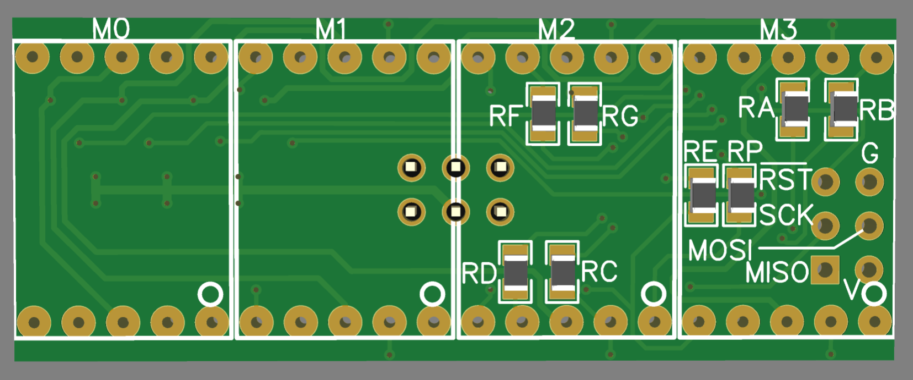

# Electronics - version 2

Seven-Segment over Serial: a device consisting of four 7-segment display units, 
controllable via a serial link, to be usable as display for LEGO Mindstorms Robot Inventor or Spike Prime.

## Introduction

This section is about the _second_ iteration of the electronics.
In this second iteration I tried to make the design smaller by integrating two boards: "SSoS" and "Nano". 
The "SSoS" board is the board from the [first iteration](../electronics), 
and the "Nano" is a standard Arduino Nano.
The integrated board is nicknamed SSoSS: Seven-Segment over Serial Small.

For firmware, fonts, enclosure, user manual, LEGO code, see parent [page](..).

This article is about me switching to SMT components.

## How to get a PCB with components mounted by JLCPCB?

I make all my PCB designs with [EasyEDA](https://easyeda.com/).
Once the design is ready, I let EasyEDA export a gerber, and I send that to [JLCPCB](https://jlcpcb.com/DMP) to get it manufactured.
There is a third company in the mix, [LCSC](https://lcsc.com/); this is a component supplier.

### EasyEDA - select components

Design the schematics as usual.
For each component you add to the schematics you have to make a choice
 - JLCPCB can't mount it because JLCPCB can only mount on one side of the board and this component needs to be on the other side.
 - JLCPCB can't mount it because its supplier, LCSC, doesn't have the component on stock.
 - You tell JLCPCB not to mount it because it is only needed for testing, or you have plenty stock, or its is cheaper.
 - or ... you want it mounted.

In the latter case be sure to select a component from LCSC, because that is the supplier of JLCPCB.
There are two ways: you can do that in EasyEDA or in JLCPCB.
There are three classes of components
 - JLCPCB can not deliver it (not in LCSC catalogue or Stock is 0)
 - It is an so called _Extended Part_. This means that JLCPCB has it, but it is not in the parts feeder by default.
   This means an operator needs to change the feeder on the pick and place machine, 
   you have to pay ~$3 per extended component class (plus the normal per component cost).
 - It is an so called _Basic Part_. This means that JLCPCB has it in the feeders of the pick an place machines.
   You only pay the per component cost.

Finding a componnet in the EasyEDA design tool.
 - Open the `Library` tool in the designer.
 - Enter a search term, e.g. `220 0805` for a 220 ohm resistor in size 0805.
 - Search in `Class` LCSC.
 - Sort on `JLCPCB Part Class` so that we can check if there is a Basic Part (cheaper).
 - Click it and check Stock in the bottom of the screen (example below: 182000 pieces).
 - An important number is the part number `C17557` as can be seen in the bottom line of the example in below screenshot.
 
  

This works ok, but somehow, I find it easier to search for parts on the JLCPCB website.

 - In the main page select `Resources` then `SMT Parts Library`.
 
   
   
 - You can serach by category (resistors, transistors, diodes), and/or using filters, or simple keyword search.
   For example if you search for `220Ω 0805` (ALT-235 gives the Ω in windows) and place a checkmark for Basic Parts
   we hit on the same component as before.
   
   
   
 - Click a (the) component for details
 
   
   
   Note that we have the same part number as when searching via EasyEDA.
   
 - Just enter that number in the Library search box of Easy EDA.
 
   

In my case, after picking all SMD components, this is the resulting [schematic](Schematic_SSoSS.pdf).

### EasyEDA - design PCB

Once the schematics is drawn with the JLCPCB supported components, proceed to the PCB layout as usual.
No special attention here, other then to draw the components you want mounted all on the same side.

In my case, this is the resulting PCB, [front](front-3D.png) and [back](back-3D.png) view.

An extra step is needed when exporting the project. In addition to the gerber file, 
JLCPCB needs a bill of material (BOM) and pick and place instructions.
You find the other two also in the File menu, around the gerber exported.

For my project, all exported files are in the [order2](order2) directory.

### JLCPCB - import

In JLPCB 
 - Go to the PCB quote form.

 - Drag in the gerber file we just exported. As usual we get a preview.
   We leave all parameters to standard. Cost are very low: $2 for special offer small 5 PCBs, plus $4 lowest shipping.

 - The first step is to enable component mounting at the bottom of the form.

   

 - The pricing changes. You now have to pay $8 general setup cost and $1.50 to make a stencil
   (a metal sheet with holes matching the component pads, this is used to apply the soldering paste at the correct spots).
   So total cost is now $2+$8+$1.50 or $11.50 plus shipping (still $4).

 - The form also expands: we have to chose which side will be polulated with components, 
   and how many of the PCBs we want to get components. Somehow, we can only chose all 5 or just 2.

   .

 - Once that is Confirmed, we get a new form, where we need to upload the BOM file we exported earlier
   and the pick and place instructions. Also you need to fill out the kind of project your are making
   `Electronics and Hobbies - DIY`.

   .
 
 - Once the BOM and pick&place files are uploaded, we get a new form.
   Here we can see if there are problems with components (you selected one whose stock ran out - yes I had that!).
   More importantly, you can deselect components. For example, I do not want J1 and J2 to be mounted.
   I was suprised to see them here enabled, because they are not SMT components.

   .

   The Qty column confused me at first. It does _not_ show actual quantity, 
   but what "rank" your order is in (e.g. 1-19, 20-199, 200-599, 600-2999), because the determines the price.
   Often the first rank (very low quantities like I have) the price is fixed irrespective of 
   quantity; if you fold the line item open it reads e.g. `*For qty≤20, charges a fixed fee of €0.0203`.

   Extended components are required to change the feeders on the pick and place machines,
   which requires an additional labor fee, $3 per Extended Component.

 - After clicking next, we are back at the main form.
 
   We see which components are placed (basically a copy of the previous  list), but also
   which components are not. In my case that is the two deselected headers and the components
   on the back side. A nice cross-check.
   
   .
   
 - Pricing has gone up: we have to pay for all components, we have to pay for changing the feeders 
   (2 extended components so $6 in total), and we have to pay for the solder 
   (they claim $0.0017 per solder joint but that would be nearly 400 joints).

   .
   
 - When I put this in my cart and paid there was an unpleasant surprise.
   Suddenly I had to pay $12 tax. That had never happened before.
   And shipping increased to $8. Is that the extra weight?
   
   I also stumbled on another problem: I had multiple gift cards (vouchers) but could only hand in one.

## Considerations and doubts on the tech side

 - I used the ATMega328, not the ATM168 from SSoS, LCSC doesn't have the 168.
 - The ATMega328 on LCSC is very expensive ($10), so I only make two boards.
 - I'm a digital (software) guy, so I have doubts in the analogue domain
   - Do I have the correct oscillator (I need 8MHZ for ATMega328 at 3V3) - correct capacitance?
   - Are the transistors correct?
   - There is no cap on the RESET# pin.
   - No ground poor.
 - Will ICSP header work; can I program the ATMega328 (with the bootloader, which fuse settings do I need).
 - I will solder J2 (IDC connector) myself, and J1 (ICSP) will not be mounted.
 - I will solder RA..RP myself (JLCPCB can only do one side), they are 0805.
 - I did make my own 3D model of the [IDC connector](IDC3dModel).
 
 
(end)
