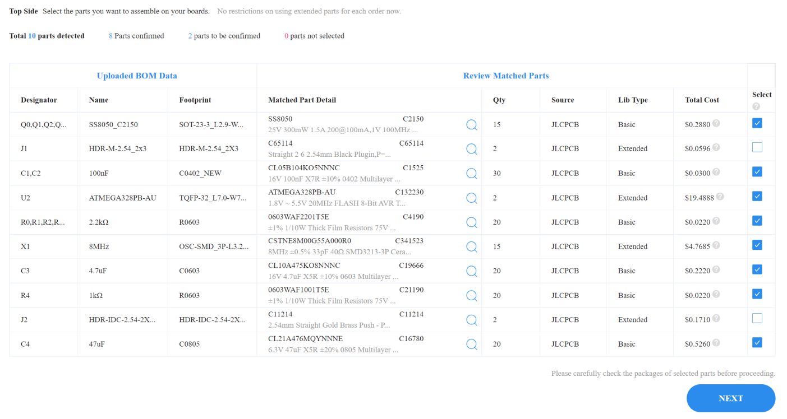

# Electronics - version 2

Seven-Segment over Serial: a device consisting of four 7-segment display units, 
controllable via a serial link, to be usable as display for LEGO Mindstorms Robot Inventor or Spike Prime.

This page is about the _second_ iteration of the electronics.

The first iteration, depicted below, needed a miniaturization. 

Miniaturization is achieved by using the SMT service of [JLCPCB](https://jlcpcb.com/DMP).
They sponsored this project.

## Introduction

In this miniaturization step I tried to make the design smaller by integrating two boards: "SSoS" and "Nano". 
The "SSoS" board is the board from the [first iteration](../electronics), 
and the "Nano" is a standard Arduino Nano.
The integrated board is nicknamed SSoSS: Seven-Segment over Serial Small.

For firmware, fonts, enclosure, user manual, LEGO code, see parent [page](..).

This article is about switching to SMT components.

## How to get a PCB with components mounted by JLCPCB?

I make all my PCB designs with [EasyEDA](https://easyeda.com/).
Once the design is ready, I let EasyEDA export a Gerber, and I send that to [JLCPCB](https://jlcpcb.com/DMP) to get it manufactured.
There is a third company in the mix, [LCSC](https://lcsc.com/); this is a component supplier.

### EasyEDA - select components

Design the schematics as usual.
For each component you add to the schematics you have to make a choice
 - JLCPCB can't mount it because JLCPCB can only mount on one side of the board and this component needs to be on the other side.
 - JLCPCB can't mount it because its supplier, LCSC, doesn't have the component on stock.
 - You tell JLCPCB not to mount it because it is only needed for testing, or you have plenty stock yourself, or its is cheaper.
 - ... You want it mounted.

In the latter case be sure to select a component from LCSC, because that is the supplier of JLCPCB.
There are three classes of components
 - JLCPCB can not deliver it (not in LCSC catalog or the LCSC stock is depleted).
 - The component is a so-called _Extended Part_. 
   This means that JLCPCB has it, but it is not in the parts feeder by default.
   An operator needs to change the feeder on the pick and place machine, 
   you have to pay ~$3 per extended component class (plus the normal per component cost).
 - It is a so-called _Basic Part_. 
   This means that JLCPCB has it in the feeders of the pick an place machines.
   You only pay the per component cost.

There are two ways to find a component: 
you can do that in EasyEDA designer or on JLCPCB website.

Finding a component in the EasyEDA design tool.
 - Open the `Library` tool in the designer.
 - Enter a search term, e.g. `220 0805` for a 220 ohm resistor in size 0805.
 - Search in `Class` LCSC.
 - Sort on `JLCPCB Part Class` so that we can check if there is a _Basic Part_ (they are cheaper after all).
 - Click the wanted component and check _Stock_ at the bottom of the screen (example below: 182000 pieces).
 - An important number is the _LCSC Part#_, also at the bottom line.
   See the example in below screenshot, finding component `C17557`.
 
   

This works OK, but somehow, I find it easier to search for parts on the JLCPCB website.

 - In the main page select `Resources` then `SMT Parts Library`.
 
   
   
 - You can search by category (resistors, transistors, diodes), and/or using filters, or simple keyword search.
   For example if you search for `220Ω 0805` (ALT-235 gives the Ω in windows) and place a check mark for _Basic Parts_
   we find the same component as before.
   
   
   
 - Click the component for to fold open its details
 
   
   
   Note that we have the same part number as when searching via EasyEDA.
   
 - Just enter that number in the Library search box of Easy EDA.
 
   

In my case, after picking all SMD components, this is the resulting [schematic](Schematic_SSoSS.pdf).
You can't see it from the schematics (but you can see it in the EasuEDA designer), 
but all SMD components can be sourced from LCSC.

### EasyEDA - design PCB

Once the schematics is drawn with the JLCPCB supported components, proceed to the PCB layout stage as usual.
No special attention here, other then to draw the components you want mounted all on the same side.

In my case, this is the resulting PCB, [front](front-3D.png) and [back](back-3D.png) view.
The back side will not be mounted by JLCPCB, so I took big 0805 components that I will mount myself.

An extra step is needed when exporting the project. In addition to the _Gerber_ file, 
JLCPCB needs a _bill of material_ (BOM) and _pick and place_ instructions.
You find the other two exports also in the File menu, above and below the Gerber exporter.

For my project, all exported files are in the [order2](order2) directory.

### JLCPCB - import

We visit the [JLCPCB](https://jlcpcb.com/DMP) website to prepare our order.

 - Go to the PCB quote form.

 - Drag in the Gerber file we just exported. As usual we get a preview.
   We leave all parameters to standard. 
   Cost are very low: $2 for the special offer (5 small PCBs), plus $4 for lowest shipping.

 - The first step is to enable component mounting at the bottom of the form.

   

 - The pricing changes. You now have to pay $8 general setup cost and $1.50 to make a stencil
   (a metal sheet with holes matching the component pads, this is used to apply the soldering paste at the correct spots).
   So total cost is now $2+$8+$1.50 or $11.50 plus shipping (still $4).

 - The quote form also expands: we have to chose which side will be populated with components, 
   and how many of the PCBs we want to be assembled. 
   Bit strange: we can only chose all 5 or just 2, but 2 is fine for me.

   

 - Once that is confirmed, we get a dialog, where we need to upload the _BOM file_ 
   and the _pick and place file_ we exported earlier. 
   Also you need to fill out the kind of project your are making, I selected `Electronics and Hobbies - DIY`.

   
 
 - Once the BOM and pick&place files are uploaded, we get a new form for part selection.
   Here we can see if there are problems with components (you selected one whose stock ran out - yes I had that!).
   More importantly, you can deselect components. For example, I do not want J1 and J2 to be mounted.
   I was surprised to see them enabled, because they are not SMT components, 
   but apparently JLCPCB has an optional hand mounting post processing step - nice!

   

   The Qty column confused me at first. It does _not_ show actual quantity, 
   but what "rank" your order is in (e.g. 1-19, 20-199, 200-599, 600-2999), because that determines the price.
   When you need low quantities (as I do) you are in the first rank. 
   That rank is a bit special: the price is fixed irrespective of quantity; 
   if you fold the line item open it reads e.g. `*For qty≤20, charges a fixed fee of €0.0203`.

   If you select an extended component, JLCPCB is required to change the feeders on the pick and place machines,
   which requires an additional labor fee, $3 per Extended Component type.

 - After clicking next, we are back at the main form.
 
   We see which components are placed (basically a copy of the previous  list), but also
   which components are not. In my case that is the two deselected headers and the components
   on the back side. A nice cross-check.
   
   
   
   Note that passives (resistors, capacitors) are typically very low priced 
   (although for these small quantities we are in lowest ranl and pay the relatively high fixed price).
   The ATMEGA is unbelievably high priced. An Arduino Nano board with that ATMEGA goes for $2 on AliExpress.
   I guess I pay for the semiconductors shortage (April 2022).
   
   Also the oscillator is expensive. On top of that, the ATMEGA and oscillator are extended components so
   we need to pay and extra $3 for both.
   
 - Pricing has gone up: we have to pay for all components, we have to pay for changing the feeders 
   (2 extended components so $6 in total), and we have to pay for the solder 
   (JLCPCB states $0.0017 per solder joint but that would be nearly 400 joints).

   
   
 - When I put this in my cart and paid there was an unpleasant surprise.
   Suddenly I had to pay $12 tax. That had never happened before.
   And shipping increased to $8. Is that the extra weight?
   Feels a bit excessive. 
   
   I also stumbled on another problem: I had multiple gift cards (vouchers) but could only hand in one.

## Considerations and doubts on the tech side

Considerations before producing the board:
 - I used the ATmega328, not the ATM168 from SSoS, LCSC doesn't have the 168.
 - The ATmega328 on LCSC is very expensive ($10), so I only make two boards.
 - I'm a digital (software) guy, so I have doubts in the analogue domain
   - Do I have the correct oscillator (I need 8MHZ for ATmega328 at 3V3) - correct capacitance?
   - Are the transistors correct?
   - There is no cap on the RESET# pin.
   - No ground poor.
 - I will solder J2 (IDC connector) myself, and J1 (ICSP) will not be mounted.
 - I will solder RA..RP myself (JLCPCB can only do one side), they are 0805.
 - I did make my own 3D model of the [IDC connector](IDC3dModel).

Considerations after producing the board:
 - One LED on the PCB might have been nice for testing bringup.
 - The ATmega328PB that I took is not nicely supported by Arduino. It works, but an ATmega328P would have been easier.

## Flashing

The board is back, from 2022-04-17 to 2022-04-23 for production and mounting (5 days) to 2022-05-04.
In total 18 days for manufacturing and shipping. 

There was one thing to caught me by surprise: the board had two holes I did not put there,
see the red encircled areas. I guess those are put by JLCPCB to have anchor points 
for the solder paste mask.

 
The [flashing](flashing) took some trial and error.
 
(end)
