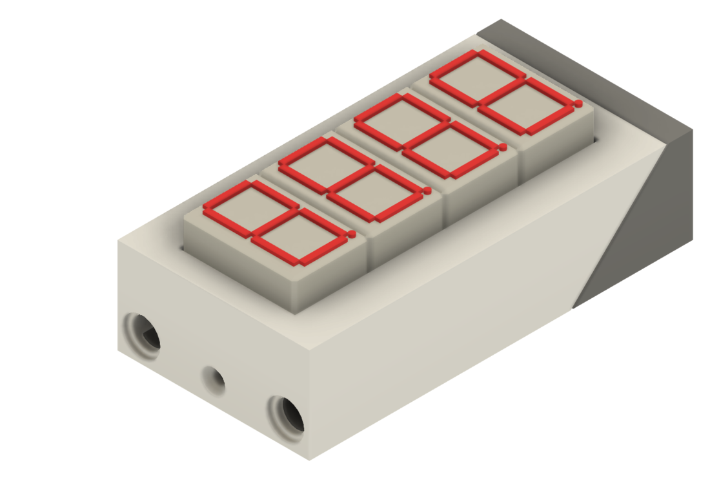
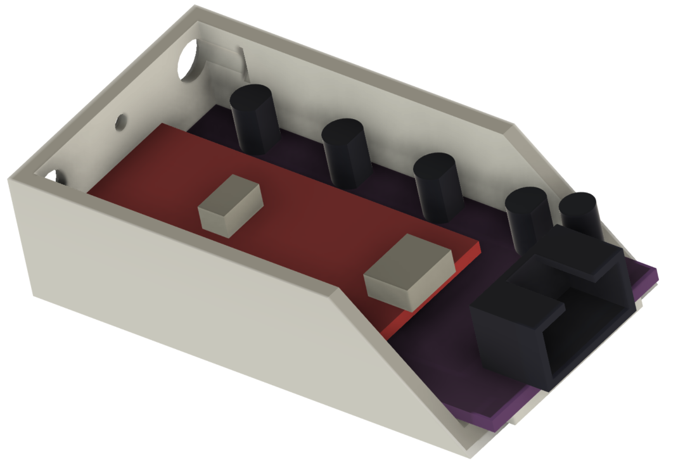
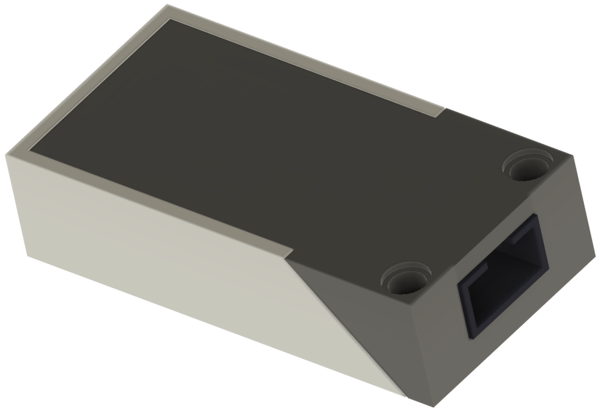

# Enclosure

I made an enclosure (case) for the _Seven-Segment over Serial_ device.

## 3D modeling 

I designed the enclosure in Fusion 360, and printed it on my Cetus3D.

Here we look from the top to the bottom on the inside.

The PCB is modeled to check the fit.

The top closes the enclosure. One screw is needed (and a brass insert).

Here we look from the bottom to the top on the inside.

The PCB is modeled to check the fit.

The bottom closed the enclosure.

## STL files

Here is the STL file for the
[top](case-top.stl)

.

Here is the STL file for the
[bottom](case-bottom.stl)

.

## 3D print results

The 3D printed top and bottom and the PCB.

The end result, assembled

and with the cable

connected to the hub.

(end)

