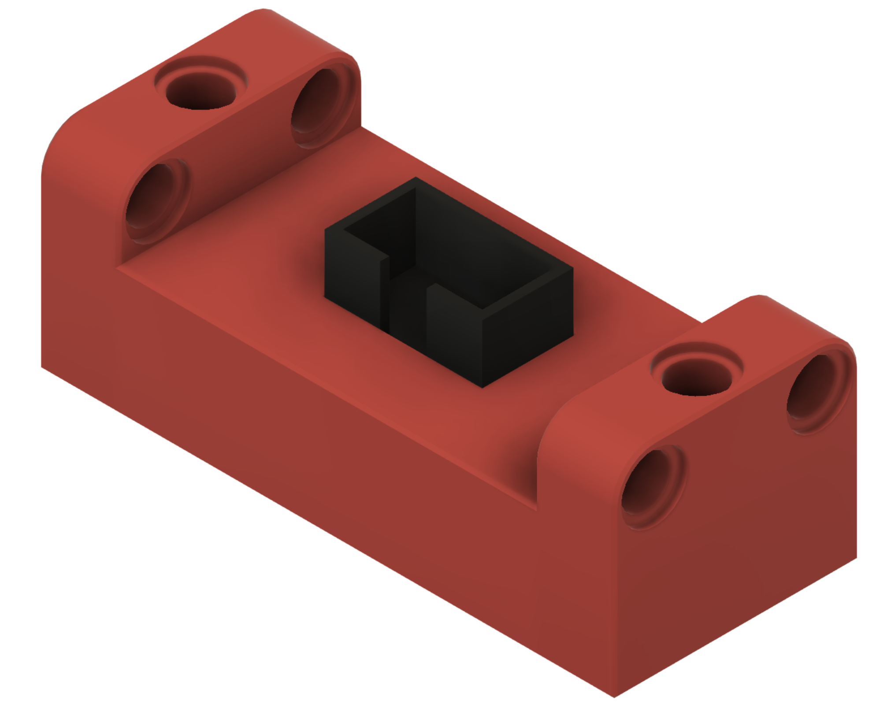
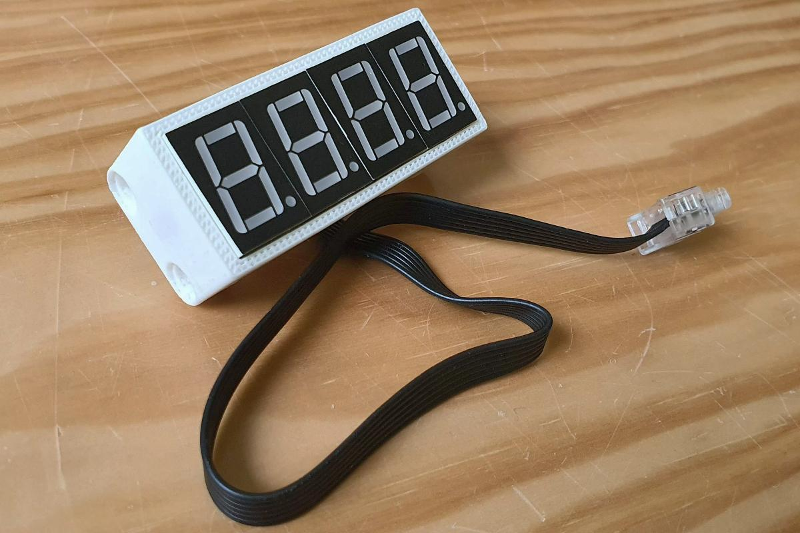

# Enclosure version 2 (small)

I made an enclosure (case) for the _Seven-Segment over Serial Small_ device.

I designed the enclosure in [Fusion 360](https://www.autodesk.eu/products/fusion-360), 
and printed it on my [Cetus3D](https://shop.tiertime.com/product/cetus-3d-printer-mk3/).

I made one key design decision: the PCB has a friction-fit in the enclosure. 
That is the plan: no screw, no glue, maybe a bit of click.

[JLCPCB](https://jlcpcb.com/DMP) offered me to try their 3D-printing services, which is gladly accepted.

## 3D modeling 

I started by modelling the PCB with some key components.

Here is the PCB, but now in its enclosure.

This is the enclosure in isolation.

The final figures show a sectional view on the short and long side

## STL files

Here is the STL file for the enclosure.
It is a single [stl file](enclosure.stl)

## 3D print results on Cetus3D

## Electronics enclosed

Finally, with cable and hub.

## 3D print via JLCPCB

[JLCPCB](https://jlcpcb.com/DMP) offers various 3D printing technologies:
- **SLA (resin)**  
  SLA or Stereolithography is an additive manufacturing process that belongs to the vat photopolymerization family. 
  The vat contains photo sensitive (liquid) resin and a light source (e.g. laser) is used to cure (solidify) the resin 
  ([youtube](https://www.youtube.com/watch?v=TuubPMWeQQE&t=143s)).
  This method is popular because it produces high-accuracy parts with fine features and smooth surface.
  
  JLCPCB offers 3 resins: LEDO 6060, 9000R and 8000. They are all white.
  Also the lowest cost, my model is $1.
  
  
  
- **MJF (Nylon)**  
  MJF or Multi Jet Fusion is an industrial 3D printing process that quickly produces nylon parts.
  It uses an inkjet array to apply (fusing and detailing) "ink" across a bed of nylon powder, which are then fused with heat. 
  The process repeats layer after layer ([youtube](https://www.youtube.com/watch?v=KKyQJLe_G6o)).
  
  JLCPCB offers 2 nylons: PA12-HP (black or gray) or PAC-HP (multicolor).
  The PA12-HP is still affordable ($3.64 for my model), but PAC-HP gets expensive ($23.64)
  
  

- **SLM (metal)**  
  SLM or Selective Laser Melting (aka DMLM or direct metal laser melting), is a method for a metal additive manufacturing technology.
  It uses a bed of powder with a heat source to create metal parts ([youtube](https://www.youtube.com/watch?v=yiUUZxp7bLQ))
  
  JLCPCB offers 1 material: 316L stainless steel. Higher price range: $23.56 for my model.
  
  
  
- **FDM (ABS)**  
  FDM or Fused Deposition Modeling (or Fused Filament Fabrication) is the offical name for the well-known process used in hobby printers.
  It works by depositing melted filament material (plastic wire from a spool) over a build platform 
  layer by layer until you have a completed part ([youtube](https://www.youtube.com/watch?v=raSAhXb2ea4)).
  
  JLCPCB offers 1 material: ABS in white and black. Moderate price point: $3.83.

  

(end)

