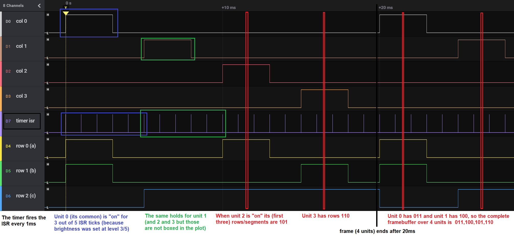

# Firmware

The firmware for the Arduino Nano, the controller on the SSoS board.


## Proof of Concept 1 - SFRs

A first proof-of-concept Arduino [sketch](poc1) is available.
It tests
 - Direct SFR writes
 - Timing (5ms per unit cause no visible flicker, this is 20ms per frame, or 50Hz)
 - Receiving data to print via Serial
 - Having a font

Using SFRs (Special Function Registers) means accessing hardware registers
that control the IO pins. Instead of calling `digitalWrite()`, we call
`PORTC=...`. Not only saves this the function call overhead, more importantly,
with one write to PORTC, we set up to 8 IO pins in one go.

See the [datasheet](https://ww1.microchip.com/downloads/en/DeviceDoc/ATmega48P_88P_168P-DS40002065A.pdf?page=102) at page 102.


## Proof of Concept 2 - Timer and ISR

A second proof-of-concept Arduino [sketch](poc2) is available.
It tests using a timer to fire an ISR every 1ms.

Notes:
 - The ATmega168 has 3 timers: timer0, timer1 and timer2. 
 - All timers depend on the system clock, normally that is 16MHz, but there is a pre-scaler.
 - Timer0 is an 8bit timer; in Arduino it is used for e.g. `delay()` and `millis()`.
 - Timer1 is a 16bit timer; in Arduino it seems to be used for the Servo library.
 - Timer2 is an 8bit timer; in Arduino it seems to be used for `tone()`. PoC2 uses this one.

There is a fair bit of standardization by microchip in naming.
The register names but also the bitfields in the registers are introduced in the 
[datasheet](https://ww1.microchip.com/downloads/en/DeviceDoc/ATmega48P_88P_168P-DS40002065A.pdf?page=155) on page 155.
The names are also available in the Arduino header files.
In the case of the ATmega168, here is the header (on my windows PC)
`C:\Program Files (x86)\Arduino\hardware\tools\avr\avr\include\avr\iom168p.h`.

In the names below, replace `n` with the timer index (0, 1, or 2) - again, we use 2.
```
TCCRnA with bits      COMnA1 COMnA0 COMnB1 COMnB0 ----- -----  WGMn1  WGMn0
TCCRnB with bits      FOCnA  FOCnB  -----  -----  WGMn2 CSn2   CSn1   CSn0
TCNTn  bits not named
OCRnA  bits not named
OCRnB  bits not named
TIMSK2                -----  -----  -----  -----  ----- OCIEnB OCIEnA TOIEn
TIFR2                 -----  -----  -----  -----  ----- OCFnB  OCFnA  TOVn
```

With registers `TCCR2A` and `TCCR2B` we set the mode (Clear Timer on Compare Match: `WGM2=010`)
and the prescaler (64 with Clock Select: `CS2=100`). 
The `TCNT2` is the actual counter, we do not read or write it (but the hardware does).

With `OCR2A` we set the value to which we want the timer to count, generate and interrupt, and clear.
Since the sustem clock (`F_CPU`) is 16MHz, and the pre-scaler is 64, timer 2 is fed with a frequency of 250 000 Hz, so it will increment
every 4us. Therefore we need 250 increments for an interrupt every 1ms. Therefore we need to set `OCR2A` to 249 (because it starts counting at 0).

In `TIMSK2` we set `OCIE2A`, i.e. Interrupt Enable for Output Compare Match A.
This means that we have to install an ISR for ` TIMER2_COMPA_vect`.

See e.g. [Arduino 101: Timers and Interrupts](https://www.robotshop.com/community/forum/t/arduino-101-timers-and-interrupts/13072).
or [instructables](https://www.instructables.com/Arduino-Timer-Interrupts/).

```c
void setup() {
  // Setup builtin LED (it is on D13 = PB5)
  DDRB  = 1<<5; // pin PB5 as output

  // Setup timer2
  noInterrupts(); // Disable all interrupts - cli()
  TCCR2A = 0; // Do not understand why, but without first setting to 0, we get 4.063us instead of 1ms
  // Set Output Compare Register A for 1kHz (1ms)
  OCR2A = 16000000/*CPU*/  /  64/*prescaler*/  /  1000/*targetfreq*/  -  1;
  // Turn on CTC mode (Clear Timer on Compare Match) WGM2[210]=010 (so we only set WGM21)
  TCCR2A = 1 << WGM21;
  // Select prescaler of 64 with Clock Select CS2[210]=100 (so we only set CS22)
  TCCR2B = 1 << CS22;   
  // Enable timer compare interrupt
  TIMSK2 = 1 << OCIE2A;
  interrupts(); // Re-enable all interrupts - sei()
}

ISR( TIMER2_COMPA_vect ) {
  PORTB |= 1<<5; // ON
  PORTB &= ~(1<<5); // OFF
}
```

The logic analyzer shows the PoC2 is successful:


## Proof of Concept 3 - Full driver

Now that the Timer-interrupt mechanism is proven in PoC2, let's do a proof of concept for a complete driver.
We merge-in the [Python model](../isr) developed earlier.

Observe that we configured the driver as follows:

```
  uint8_t drv7s_framebuf[DRV7S_UNITCOUNT] = { 0b00000011, 0b00000100, 0b00000101, 0b00000110 };
  ...
  drv7s_brightness_set(3);
  drv7s_blinking_mode_set(1);
  drv7s_blinking_hilo_set(3,2);
  drv7s_blinking_mask_set(0b0101);
```

We hooked the logic analyzer to the four columns, the ISR, and 3 rows.
We captured a [Saleae trace](poc3-session.sal):



Notes:
 - On the left hand side we see the labeled probes, 4 rows at the top, 3 columns at the bottom and
   the timer on the middle.
 - We see that the timer indeed fires every 1 ms (10 spikes in 10 ms).
 - We see that first col 0 is hi, then col 1, then col2, and then col 3. And that repeats.
 - This means that the frame time is 20 ms (4 units of 5 ms), a frame rate of 50 Hz.
 - We see that col 0 is hi for 3 ms and lo for the next 2. This is due to the brightness setting being 3 (out of a fixed 5).
 - When col 0 is hi, we see that the row 2 is 0, row 1 is 1 and row 0 is 1. This 011 of the frame buffer.
 - Similarly col 1 is hi while the rows are 100 (second slot in the frame buffer).

On this details level, we can not see blinking; that is on frame level.
let's zoom out.


Notes:
 - On the left we see the first frame marked with 4 vertical green lines: 
   the rows are 011, 100, 101, and 110 (as we filled the frame buffer).
 - This frame is repeated 3 times - because the blinking is set to 3 hi and 2 lo.
 - The next two frames are lo. However not all units are off. 
   The mask is 0b0101, so only unit 0 and 2 shall blink, and indeed only those two are off.
 - The blinking period is 3+2, so after 5 frames the process repeats.

I do get spikes now and then (see black arrow). Spend some hours on them, but I do not understand why.
They do not cause visual artifacts...
 
(end)

