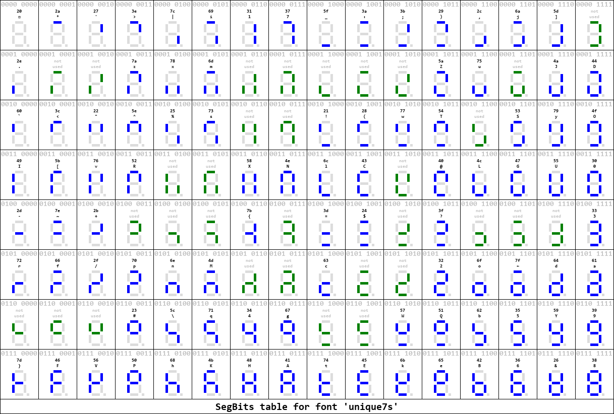
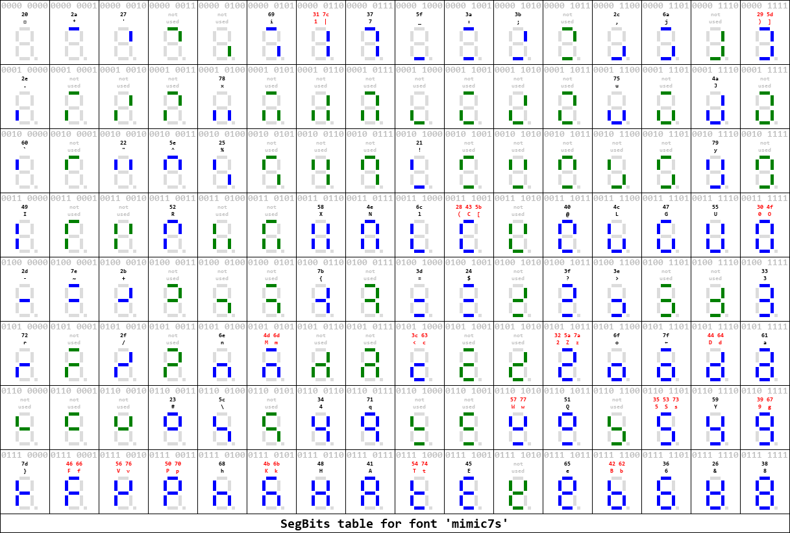

# Font

The s4x7s device contains a firmware with two fonts.
This directory contains a Python project to tabulate the fonts.

## Unique7s
The first font is named _Unique7s_. 
It maps all ASCII characters to a 7-segment display. 
The crucial design decision is that every ASCII character maps to a _unique_ display pattern. 
It makes some characters hard to read (see uppercase S or lower case f).
  
This is the ASCII table:
  

  
This is a systematic overview of all 7-segment patterns.
Note that unused patterns are green.

## Mimic7s

The second font is named _Mimic7s_. 
It maps all ASCII characters to a 7-segment display. 
The crucial design decision is each character is mapped to a 7-segment pattern that is as close as possible to what the character normally looks like. 
The downside is that one pattern may be used for several characters (see 5, uppercase S and lowercase s).
These duplicates are marked red.

This is the ASCII table:
  

  
This is a systematic overview of all 7-segment patterns:

  
## Use the script
To use the script yourself (on Windows) you need:

- Python (3.8+) on your system (add `setup.bat` to tweak the path tto `python.exe`)
- Start with an empty project directory; then copy `requirements.txt`, `setup.bat`, `run.bat`, and `tables.py` into it.
- Run `setup.bat` to create a virtual Python environment (in subdirectory `env` in the project directory). 
  Note that packages will be installed in the virtual environment, as listed in `requirements.txt`.
- Run `run.bat` to generate the tables.
- Change the font definitions in `tables.py` if you want to alter the fonts.

(end)
