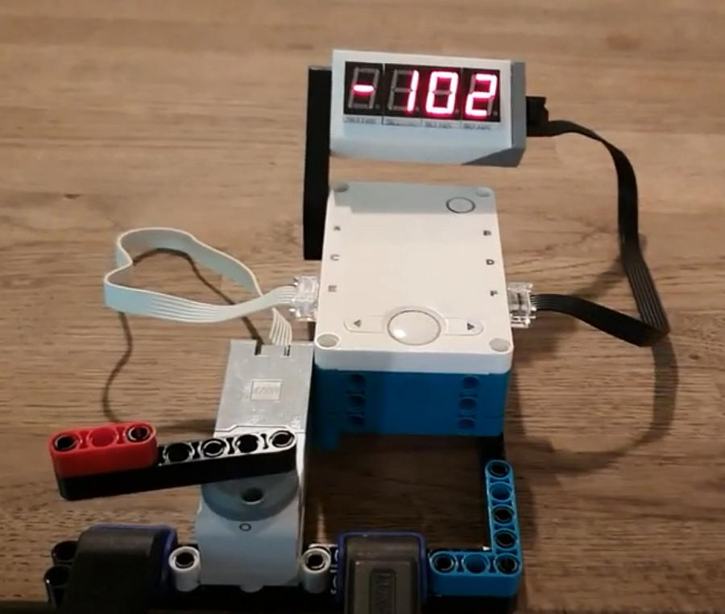

# LEGO demo

Some examples of Python code for the LEGO Mindstorms Robot Inventor to control the SSoS device.
I assume these also run on Spike Prime.


## Numbers

This is a demo that print numbers first flush left, then flush right.

Note that the SSoS device is connected to port F of the hub.
That port is first configured as serial, next the host baudrate is set to match the one used in the SSoS device.
Note that the `mode` command actually "adds" the `baud` attribute. 
However the `mode` change takes some time, so we must have a wait in between.

The flush left number are printed in character mode (using a CLEAR-AND-HOME `\f`).

The flush right number are printed in line mode, using a CURSOR-EOLN `\t` for flush right and a LINE-COMMIT `\n`.

```python
# Number demo with Seven Segment over Serial
import hub
import utime

ssos = hub.port.F
ssos.mode( hub.port.MODE_FULL_DUPLEX )
utime.sleep_ms(500)
ssos.baud(115200)
ssos.write( b"\0") # Reset SSoS device

i = 0
while i < 1234 :
    ssos.write( b"\f"+str(i/10))
    utime.sleep_ms(100)
    i += 7
ssos.write( b"\fdone")

utime.sleep_ms(2000)
ssos.write( b"\x11") # Line mode

i = 0
while i < 1234 :
    ssos.write( b"\t"+str(i/10)+"\n")
    utime.sleep_ms(100)
    i += 7
ssos.write( b"done\n")
```


## Motor

This is a demo that print the motor position (when rotated by hand).
See a [video](https://youtu.be/2fTZVQPiG7E) of this demo.

Note that the SSoS device is connected to port F of the hub.
Here we use a more elegant way to start: 
instead of waiting 500ms after changing `mode`, we wait till the `baud` appears.

The motor is connected to port E.
The `get()` function by default reports a list of 4 numbers, 
index 2 returns "Absolute position in degrees between -180 and +179" 
(this is [mode 3](https://lego.github.io/MINDSTORMS-Robot-Inventor-hub-API/class_motor.html#Motor)).

```python
# Show motor position on Seven Segment over Serial
import hub

ssos = hub.port.F
ssos.mode( hub.port.MODE_FULL_DUPLEX )
while not hasattr(ssos, 'baud') : pass # Wait till `ssos` is serial port
ssos.baud(115200)
ssos.write( b"\0")   # Reset SSoS device
ssos.write( b"\x11") # Line mode

motor = hub.port.E.motor
while True:
    angle = motor.get()[2]
    ssos.write( b"\t"+str(angle)+"\n" )
```




## Ultrasonic distance

This is a demo that prints the distance measured by an ultrasonic sensor.

Note that the SSoS device is connected to port F of the hub.
The ultrasonic sensor is connected to port A.
The `get()` function of an ultrasonic sensor reports a list of 1 numbers.
When the `FORMAT_RAW` is passed, the number seems to be the distance in millimeters.
([bast documentation](https://lego.github.io/MINDSTORMS-Robot-Inventor-hub-API/class_device.html)).
Warning: when the object is too far from the sensor, the returned distance is `None`.

```python
# Show ultrasonic sensor (port A) distance on Seven Segment over Serial (port F)
import hub

ssos = hub.port.F
ssos.mode( hub.port.MODE_FULL_DUPLEX )
while not hasattr(ssos, 'baud') : pass # Wait till `ssos` is serial port
ssos.baud(115200)
ssos.write( b"\0")   # Reset SSoS device
ssos.write( b"\x11") # Line mode

ultra = hub.port.A.device

while True:
    dist = ultra.get(ultra.FORMAT_RAW)[0]
    msg = "Far" if dist is None else str(dist)
    print(msg)
    ssos.write( b"\t"+msg+"\n" )
```


(end)
