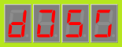
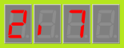
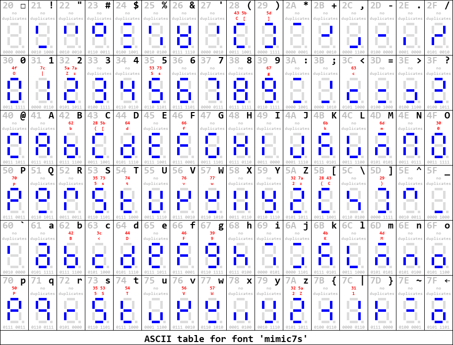

# User manual for Seven Segment over Serial

This is the user manual of the "Seven Segment over Serial", also known by its short name **SSoS**.

## Introduction

The Seven Segment over Serial device consists of 4 seven segment displays controlled by a micro-controller (an Arduino Nano).
It's key features are

 - Two built-in fonts: _mimic7s_ for optimal readability and _unique7s_ where characters have unique looks.
 - Support of brightness control and blinking.
 - Support for character mode (scrolling) and line mode (commit line at a time).
 - Control of cursor position (home, left, right, clear).
 - Composing raw patterns on the 7-segment unit(s).
 - Dot replacement (how to render the dot in `2.7`) 
 - State monitoring (show internal state temporarily on the display).

## Getting started

Starting with SSoS is relatively easy. 
 - hook it up the a host (3V3,GND) and connect host TX to SSoS RX
 - Configure UART on host as 8/N/115200.
 - Issue a write over serial: `Serial.print("\f    Hello, world!    ");`

This should clear the screen (`\f`) and scroll in "Hello, World!" and scroll that out.
The `W` will be a bit hard to read (and maybe also the `!`)

## Model

The device has a notion of a **cursor**. By default the cursor has value 0, the position of the left-most 
7-segment unit. When sending a character to the device it is placed at the position of the cursor in 
the **frame buffer** and the cursor moves one position to the right.

If the cursor has value 4, the character can not be displayed (since the frame buffer only stores
the content for 7-segment units 0, 1, 2, and 3). Therefore, the text is **scrolled** left: the left-most 
character is dropped, and the right-most unit is freed. Then frame buffer location 3 is filled with 
the incoming character. The cursor remains at 4.

When a character is received by the device, its ASCII value if first converted to a 7-segment **pattern**
by looking it up in the current **font**. It is the pattern that is stored in the frame buffer.
So changing the font does not alter the screen content that is already present.
Two fonts are available _mimic7s_ for optimal readability and _unique7s_ where characters have unique looks. 
For example, `dD5S` shows as follows (_mimic7s_ on the left, _unique7s_ on the right):

 

Note that the fonts only support ASCII. The 7-segment pattern associated by a **high "ASCII" value** `128+i`, 
is the pattern associated with ASCII value `i` but with the (decimal) dot also switched on. Note that 
_none_ of the patterns below 128 have the (decimal) dot on, so this makes all character patterns unique (in _unique7s_).

Also note that the fonts do not associate patterns with ASCII values below 32. 
Those character are not displayable, instead those are **control characters** changing the state of the SSoS device. 
For example, the FF (Form Feed) character in ASCII (hex value 0C, decimal value 12, in C with `\f`) 
will clear the frame buffer and set the cursor to 0.
Other codes will change the font, brightness, blinking, dot replacement or (scrolling) mode. Some
of the control codes need to be followed by extra bytes, e.g. to pass the font ID.

The device can operate in two modes: character (default) and line. In **character mode**, each 
(displayable) character is immediately appended to the frame buffer and is thus visible. 
As noted above, if the cursor was at position 4, this causes a scroll. 
Scrolling is a nice feature for strings longer than 4, and this is where character mode is useful.
After every scroll, the system actually pauses (a configurable CHAR-TIME) before processing the next character.
This results in a smooth scroll, assuming the host feeds characters faster than CHAR-TIME.

Downsides of character mode is speed (due to CHAR-TIME) and partial display updates. This is where line mode comes in.
In **line mode**, all (displayable) characters are appended to the line buffer.
The line buffer also has size 4, so if more characters are fed, it also scrolls, but without a delay and not visible.
The host needs to send a LINE-COMMIT (`\n`) to copy the line buffer to the frame buffer.

The device has a limited reception buffer. Care should be taken not too send too many characters from the host.
This will overflow the internal reception buffer, causing **loss of received bytes**. 
This is more likely in character mode than in line mode due to the delays in scrolling.

The device is also capable of showing the **dot** (`.`) on a 7-segment unit of its own or using the dot-segment of the previous 7-segment.
For example `2.7` can show as on the left (DOT-ENABLE) or on the right (DOT-DISABLE).

 

## Control characters

The below table gives an overview of all control characters ("commands"); details are in the subsections below.

 | HEX | DEC | NAME | KEY |C-ESC | ASCII description               | SSoS command                 |default (hex)|
 |:---:|:---:|:----:|:---:|:----:|:--------------------------------|:-----------------------------|------------:|
 |  01 |   1 |  SOH |  ^A |      | Start of Heading                | **SET-FONT(id)**             |          01 |  
 |  02 |   2 |  STX |  ^B |      | Start of Text                   | **SET-BRIGHTNESS(level)**    |          04 |  
 |  03 |   3 |  ETX |  ^C |      | End of Text                     | **SET-BLINK-MASK(mask)**     |          0F |  
 |  04 |   4 |  EOT |  ^D |      | End of Transmission             | **SET-BLINK-TIMES(hi,lo)**   |       19,19 |  
 |  05 |   5 |  ENQ |  ^E |      | Enquiry                         | **SHOW-STRINGS(id0,id1)**    |           - |  
 |  06 |   6 |  ACK |  ^F |      | Acknowledgment                  | **CURSOR-RIGHT**             |           - |  
 |  07 |   7 |  BEL |  ^G | `\a` | Bell (beep or the flash)        | **BLINK-ENABLE**             |          no |  
 |  08 |   8 |  BS  |  ^H | `\b` | Backspace                       | **CURSOR-LEFT**              |           - |  
 |  09 |   9 |  HT  |  ^I | `\t` | Horizontal Tab                  | **CURSOR-EOLN**              |           - |  
 |  0A |  10 |  LF  |  ^J | `\n` | Line Feed (moves line down)     | **LINE-COMMIT**              |           - |  
 |  0B |  11 |  VT  |  ^K | `\v` | Vertical Tab                    | **BLINK-DISABLE**            |         yes |  
 |  0C |  12 |  FF  |  ^L | `\f` | Form Feed (clear the screen)    | **CLEAR-AND-HOME**           |         yes |  
 |  0D |  13 |  CR  |  ^M | `\r` | Carriage Return (start of line) | **CURSOR-HOME**              |           - |  
 |  0E |  14 |  SO  |  ^N |      | Shift Out                       | **DOT-DISABLE**              |          no |  
 |  0F |  15 |  SI  |  ^O |      | Shift In                        | **DOT-ENABLE**               |         yes |  
 |  10 |  16 |  DLE |  ^P |      | Data Link Escape                | **CHAR-ENABLE**              |         yes |  
 |  11 |  17 |  DC1 |  ^Q |      | Device Control 1 (often XON)    | **CHAR-DISABLE**             |          no |  
 |  12 |  18 |  DC2 |  ^R |      | Device Control 2                | **CHAR-TIME(time)**          |          19 |  
 |  13 |  19 |  DC3 |  ^S |      | Device Control 3 (often XOFF)   | **PATTERN-ONE(pat)**         |           - |  
 |  14 |  20 |  DC4 |  ^T |      | Device Control 4                | **PATTERN-ALL(p0,p1,p2,p3)** |           - |  
 |  15 |  21 |  NAK |  ^U |      | Negative Acknowledgment         | **RESET**                    |           - |  

### 0x01 SET-FONT(id)
The control character SET-FONT sets the font used for new incoming characters.

The font is selected with the next byte, the font **id**.
The device supports two fonts: 0 selects _unique7s_ and 1 _mimic7s_.
Font _mimic7s_ is optimized for readability and _unique7s_ guarantees that each character has a unique look (pattern on the 7-segment display).
See the section on fonts for details.

Note that the argument byte is taken "mod 2" so `\x00`, `0`, `U`, or `u` all select _unique7s_, and `\x01`, `1`, `M`, or `m` all select _mimic7s_.

The default value is 0x01 or 1 or _mimic7s_.

### 0x02 SET-BRIGHTNESS(level)
The control character SET-BRIGHTNESS sets the brightness of the 7-segment units.

The SSoS deploys a form of PWM (fast flashing) to implement brightness.
Every 7-segment unit is processed 5 ms so one frame takes 4units×5ms or 20 ms.
During this 5ms, the unit is switched on 1, 2, 3, 4 or 5 ms, and this determines the brightness.

The **level** is set with the argument byte, ranging from dark (1) up to and including bright (5).
Note that the argument byte is taken "mod 16" so `\x01` has the same result as `1`, `A`, or `a`, and `\x05` has the same result as `5`, `E` or `e`.
Values lower than 1 are clipped to 1, values higher than 5 clipped to 5.

The default value is 0x04 or 4/5 or 80%.

### 0x03 SET-BLINK-MASK(mask)
The control character SET-BLINK-MASK determines _which_ units blink when blinking is enabled.

For a display unit to blink the following settings need to be considered
 - a mask determining which units blink (instead of always on).
 - the blinking hi and lo times (SET-BLINK-TIMES);
 - global blink enable (BLINK-ENABLE/BLINK-DISABLE);

The **mask** is set with the argument byte, only the lower 4 bits are considered.
When bit `i` from the mask is 1, unit `i` will blink - if blinking is globally enabled.
When the bit is 0, unit `i` is (always) on.

The default value is 0x0F or 15 or 0b1111 or all units blink.

### 0x04 SET-BLINK-TIMES(hi,lo)
The control character SET-BLINK-TIMES determines the hi time (unit on) and lo time (unit off) when blinking is enabled.

See SET-BLINK-MASK for all blinking settings to be considered.

This control character requires two argument bytes **hi** and **lo**.
The *hi* argument determines the unit on-time (in 20ms steps).
The *lo* argument determines the unit off-time (in 20ms steps).
Both arguments must be positive (not zero), and together they should be below 256.

The default values are 0x19 and 0x19, or 25 and 25 or 500 ms and 500 ms.

### 0x05 SHOW-STRINGS(id0,id1)
The device has a list of internal values. Each value is given an id from 0 to 41.
The control character SHOW-STRINGS will show a series of those values on the display.
This is typically a development/debug feature.

This control character requires two argument bytes **id0** and **id1**.
The control character SHOW-STRINGS will momentarily (2 sec per string) show the values from index **id0** up to (and including) index **id1**.
The upper limit is clipped to the highest id.
See separate section below for a list of strings.

Note `0x05 0x00 0xFF` will show all strings - since the `0xFF` will be clipped the the maximum.

This command will not change the state, cursor position and frame buffer are left unmodified once the command ends.

### 0x06 CURSOR-RIGHT
The control character CURSOR-RIGHT moves cursor right (if not already at after right-most position 4).

See also CURSOR-LEFT, CURSOR-EOLN, and CURSOR-HOME.

### 0x07 (`\a`) BLINK-ENABLE
The control character BLINK-ENABLE globally enables blinking (see also BLINK-DISABLE).

See SET-BLINK-MASK for all blinking settings to be considered.

By default global blinking is disabled.

### 0x08 (`\b`) CURSOR-LEFT
The control character CURSOR-LEFT moves the cursor left (if not already at left-most position 0).

See also CURSOR-RIGHT, CURSOR-EOLN, and CURSOR-HOME.

### 0x09 (`\t`) CURSOR-EOLN
The control character CURSOR-EOLN moves cursor to the right-most position (position 4).
This is convenient for printing right aligned (e.g. numbers).

See also CURSOR-LEFT, CURSOR-RIGHT, and CURSOR-HOME.

### 0x0A (`\n`) LINE-COMMIT
The control character LINE-COMMIT is ignored in character mode (CHAR_ENABLE).
When line mode is enabled, an explicit LINE-COMMIT must be given to show the line.
See model section for description.

By default character mode is enabled.

### 0x0B (`\v`) BLINK-DISABLE
The control character BLINK-DISABLE globally disables blinking (see also BLINK-ENABLE).

See SET-BLINK-MASK for all blinking settings to be considered.

By default global blinking is disabled.

### 0x0C (`\f`) CLEAR-AND-HOME
The control character CLEAR-AND-HOME clears the screen (i.e. the frame/line buffer) and homes the cursor.

### 0x0D (`\r`) CURSOR-HOME
The control character CURSOR-HOME homes the cursor, i.e. sets it to 0. It does not clear screen.

See also CURSOR-RIGHT, CURSOR-LEFT, and CURSOR-RIGHT.

### 0x0E DOT-DISABLE
The control character DOT-DISABLE disables dot replacement. See Model section for details (see also DOT-ENABLE).

By default dot is enabled.

### 0x0F DOT-ENABLE
The control character DOT-DISABLE disables dot replacement. See Model section for details (see also DOT-DISABLE).

By default dot is enabled.

### 0x10 CHAR-ENABLE
The control character CHAR-ENABLE enables character mode (as opposed to line mode, see CHAR-DISABLE). See Model section for details.
When character mode is enabled, make sure the CHAR-TIME is set as desired.

Note that the device throttles reception of characters, so care should be taken not too send too many characters from the host.
This will overflow the internal reception buffer, causing loss of received bytes.

By default character mode is enabled.

### 0x11 CHAR-DISABLE
Disables character mode (and thus enables line mode).

The control character CHAR-DISABLE (disables character mode and thus) enables line mode. See Model section for details.
When line mode is enabled, make sure to send a LINE-COMMIT (`\n`) at the end of each line.

By default character mode is enabled.

### 0x12 CHAR-TIME(time)
The control character CHAR-TIME sets the wait time per character scrolled.

The **time** is set with the argument byte, ranging from no delay (0) up to max delay (255*20ms).
The argument may be 0, and the unit is steps of 20 ms.

For a smooth scroll on an empty display (to be more precise, when the cursor is 0), 
it is advised to start the message with 4 spaces, because the scroll delay is only applied when there is a _scroll_ of a character.

The default value is 0x19, or 25, or 500 ms.

### 0x13 PATTERN-ONE(pat)                                                                                        
The control character PATTERN-ONE adds a raw pattern to the display at the cursor position (instead of looking up a pattern from an ASCII value in the font).

The **pat** is passed with the argument byte, a bit mask indicating which segments to switch on. 
Traditionally, the segments are labeled A-G (and P for the decimal point) in a clockwise fashion.
The bits of **pat** map to those segments in order:

In other words, the character `1` typically switches on segments B and C, mapping to pattern 0b00000110, so the argument byte would be 0x06.

This control sequence inserts a character in the flow, so it moves the cursor and optionally scrolls.

### 0x14 PATTERN-ALL(p0,p1,p2,p3)                                                                                
The control character PATTERN-ALL adds a raw pattern to the complete display (all 4 units).

The **p0**, **p1**, **p2**, and **p3** are the raw patterns for units 0 to 3 respectively.

This control sequence directly accesses the frame buffer; it does not use the cursor, nor the line buffer.

### 0x21 RESET
The control character RESET will reset all settings to their default.
This includes clear screen.

The table at the start of this section shows the defaults (see last column).

Note that on power-up, the device performs a reset
but also prints its name (SSoS). 
So a CLEAR-AND-HOME as a first command makes sense.

## Fonts

This is the font table for _unique7s_ (not the default font):

This is the font table for _mimic7s_ (the default font).
The cells with red marks have visual duplicates.

## Strings

The table below enumerates all strings that command 0x05 `SHOW-STRINGS(id0,id1)` can show.
The odd entries are the actual values, the even values just before them a 4 letter description.

 |ID(hex)|ID(dec)| String                                            |
 |:-----:|:-----:|:--------------------------------------------------|
 |   00  |    0  | `APP`                                             |
 |   01  |    1  | SSoS app version e.g. `5.1`                       |
 |   02  |    2  | `IDE`                                             |
 |   03  |    3  | Arduino IDE version e.g. `1.8.13`                 |
 |   04  |    4  | `CC`                                              |
 |   05  |    5  | The C-compiler version, e.g. `7.3.0`              |
 |   06  |    6  | `YEAR`                                            |
 |   07  |    7  | Build time, year part e.g. `2022`                 |
 |   08  |    8  | `Mnth`                                            |
 |   09  |    9  | Build time-stamp, month part e.g. `Jan`           |
 |   0A  |   10  | `DAY`                                             |
 |   0B  |   11  | Build time-stamp, day part e.g. `16`              |
 |   0C  |   12  | `TIME`                                            |
 |   0D  |   13  | Build time-stamp, hour.min part e.g. `19.55`      |
 |   0E  |   14  | `BRIT`                                            |
 |   0F  |   15  | Brightness level, e.g. `0x04`                     |
 |   10  |   16  | `BL.en`                                           |
 |   11  |   17  | Blinking globally enabled, e.g. `0x00`            |
 |   12  |   18  | `BL.hi`                                           |
 |   13  |   19  | Blinking hi time, e.g. `0x19`                     |
 |   14  |   20  | `BL.lo`                                           |
 |   15  |   21  | Blinking lo time, e.g. `0x19`                     |
 |   16  |   22  | `BL.mk`                                           |
 |   17  |   23  | Blinking mask, e.g. `0x0F`                        |
 |   18  |   24  | `DSP.0`                                           |
 |   19  |   25  | Content of display unit (frame buf) 0, e.g. `0x6D`|
 |   1A  |   26  | `DSP.1`                                           |
 |   1B  |   27  | Content of display unit (frame buf) 1, e.g. `0x6D`|
 |   1C  |   28  | `DSP.2`                                           |
 |   1D  |   29  | Content of display unit (frame buf) 2, e.g. `0x5C`|
 |   1E  |   30  | `DSP.3`                                           |
 |   1F  |   31  | Content of display unit (frame buf) 3, e.g. `0x6D`|
 |   20  |   32  | `FONT`                                            |
 |   21  |   33  | Current font, e.g. `0x01`                         |
 |   22  |   34  | `CUR`                                             |
 |   23  |   35  | Current cursor position, e.g. `0x00`              |
 |   24  |   36  | `DOT`                                             |
 |   25  |   37  | Dot enabled, e.g. `0x01`                          |
 |   26  |   38  | `CH.en`                                           |
 |   27  |   39  | Character mode enabled, e.g. `0x01`               |
 |   28  |   40  | `CH.tm`                                           |
 |   29  |   41  | Character time, e.g. `0x19`                       |

(end)
