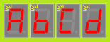

# User manual for Seven Segment over Serial

This is the user manual of the "Seven Segment over Serial", also known by its short name **SSoS**.


## Introduction

The Seven Segment over Serial device consists of 4 seven segment displays controlled by a micro-controller (an Arduino Nano).
It's key features are

 - Two built-in fonts: one for optimal readability and one where all characters have unique looks.
 - Support of brightness control and blinking.
 - Support for character mode (scrolling) and line mode (commit line at a time).
 - Control of cursor position (home, left, right, clear).
 - Composing raw patterns on the 7-segment unit(s).
 - Dot replacement (how to render the dot in `2.7`) 
 - State monitoring (show internal state temporarily on the display).


## Getting started

Starting with SSoS is relatively easy. 
 - Hook it up the a host (3V3,GND) and connect host TX to SSoS RX
 - Configure UART on host as 8/N/115200.
 - If the host powers or resets the board, make sure to wait 2 sec before sending commands (SSoS needs 2 seconds to boot).
   It shows a LED test  
     
   and then its name  
   
 - Issue a write over serial: 
   ```python
   write("\f    Hello, world!    ")
   ```
 - This should clear the screen (`\f`) and scroll in "Hello, World!" and scroll that out.
   The `W` will be a bit hard to read (and maybe also the `!`)


## Examples

Here are two examples of using SSoS via its USB port, connected to a PC, using Python to control SSoS.

Simple example:

```python
import serial
import time

ssos = serial.Serial('COM3',115200) # Resets board, so wait ~2sec
time.sleep(2)

ssos.write( b'\0HI')
```


On a PC the DTR line causes a reset; if we pull it low, the boot is faster

```python
import serial

ssos = serial.Serial(None,115200) # port=None, so not yet opened
ssos.dtr = False # Makes sure the board does not reset (would take 2 seconds)
ssos.port='COM3' # Specify port
ssos.open()      # Now open (fast)

ssos.write( b'\0HI')
```


## Model

The device has a notion of a **cursor**. By default the cursor has value 0, the position of the left-most 
7-segment unit. When sending a character to the device it is placed at the position of the cursor in 
the **frame buffer** and the cursor moves one position to the right.

If the cursor has value 4, the character can not be displayed (since the frame buffer only stores
the content for 7-segment units 0, 1, 2, and 3). Therefore, the text is **scrolled** left: the left-most 
character is dropped, and the right-most unit is freed. Then frame buffer location 3 is filled with 
the incoming character. The cursor remains at 4.

When a character is received by the device, its ASCII value if first converted to a 7-segment **pattern**
by looking it up in the current **font**. It is the pattern that is stored in the frame buffer.
So changing the font does not alter the screen content that is already present.
Two fonts are available _LookAlike7s_ for optimal readability and _Unique7s_ where characters have unique looks. 
For example, `dD5S` shows as follows (_LookAlike7s_ on the left, _Unique7s_ on the right):

 

Note that the fonts only support ASCII. The 7-segment pattern associated by a **high "ASCII" value** `128+i`, 
is the pattern associated with ASCII value `i` but with the (decimal) dot also switched on. Note that 
_none_ of the patterns below 128 have the (decimal) dot on, so this makes all character patterns unique (in _unique7s_).

Also note that the fonts do not associate patterns with ASCII values below 32. 
Those character are not displayable, instead those are **control characters** changing the state of the SSoS device. 
For example, the FF (Form Feed) character in ASCII (hex value 0C, decimal value 12, in C with `\f`) 
will clear the frame buffer and set the cursor to 0.
Other codes will change the font, brightness, blinking, dot replacement or (scrolling) mode. Some
of the control codes need to be followed by extra bytes, e.g. to pass the font ID.

The device can operate in two modes: character (default) and line. In **character mode**, each 
(displayable) character is immediately appended to the frame buffer and is thus visible. 
As noted above, if the cursor was at position 4, this causes a scroll. 
Scrolling is a nice feature for strings longer than 4, and this is where character mode is useful.
Just before every scroll step, the system actually pauses (a configurable CHAR-TIME).
This results in a smooth scroll, assuming the host feeds characters faster than CHAR-TIME.

Downsides of character mode is speed (due to CHAR-TIME) and partial display updates. This is where line mode comes in.
In **line mode**, all (displayable) characters are appended to an internal line buffer.
The line buffer also has size 4, so if more characters are fed, it also scrolls, but without a delay and not visible.
The host needs to send a LINE-COMMIT (`\n`) to copy the line buffer to the frame buffer.

The device has a limited reception buffer. Care should be taken not too send too many characters from the host.
This will overflow the internal reception buffer, causing **loss of received bytes**. 
This is more likely in character mode than in line mode due to the delays in scrolling.

The device is also capable of showing the **dot** (`.`) on a 7-segment unit of its own or using the dot-segment of the previous 7-segment.
For example `2.7` can show as on the left (DOT-ENABLE) or on the right (DOT-DISABLE).

 


## Control characters

The below table gives an overview of all control characters ("SSoS commands"); 
details are in the subsections below.
Most subsections come with an example, the [source](examples/examples.py) is available in this repo.

 | HEX | DEC | NAME | KEY |C-ESC | ASCII description               | SSoS command             |default (hex)|
 |:---:|:---:|:----:|:---:|:----:|:--------------------------------|:-------------------------|------------:|
 |  00 |   0 |  NUL |  ^@ |  \0  | Null                            | RESET                    |           - |
 |  01 |   1 |  SOH |  ^A |      | Start of Heading                | SET-FONT(id)             |          00 |  
 |  02 |   2 |  STX |  ^B |      | Start of Text                   | SET-BRIGHTNESS(level)    |          04 |  
 |  03 |   3 |  ETX |  ^C |      | End of Text                     | SET-BLINK-MASK(mask)     |          0F |  
 |  04 |   4 |  EOT |  ^D |      | End of Transmission             | SET-BLINK-TIMES(hi,lo)   |       19,19 |  
 |  05 |   5 |  ENQ |  ^E |      | Enquiry                         | SHOW-STRINGS(id0,id1)    |           - |  
 |  06 |   6 |  ACK |  ^F |      | Acknowledgment                  | CURSOR-RIGHT             |           - |  
 |  07 |   7 |  BEL |  ^G | `\a` | Bell (beep or the flash)        | BLINK-ENABLE             |          no |  
 |  08 |   8 |  BS  |  ^H | `\b` | Backspace                       | CURSOR-LEFT              |           - |  
 |  09 |   9 |  HT  |  ^I | `\t` | Horizontal Tab                  | CURSOR-EOLN              |           - |  
 |  0A |  10 |  LF  |  ^J | `\n` | Line Feed (moves line down)     | LINE-COMMIT              |           - |  
 |  0B |  11 |  VT  |  ^K | `\v` | Vertical Tab                    | BLINK-DISABLE            |         yes |  
 |  0C |  12 |  FF  |  ^L | `\f` | Form Feed (clear the screen)    | CLEAR-AND-HOME           |         yes |  
 |  0D |  13 |  CR  |  ^M | `\r` | Carriage Return (start of line) | CURSOR-HOME              |           - |  
 |  0E |  14 |  SO  |  ^N |      | Shift Out                       | DOT-DISABLE              |          no |  
 |  0F |  15 |  SI  |  ^O |      | Shift In                        | DOT-ENABLE               |         yes |  
 |  10 |  16 |  DLE |  ^P |      | Data Link Escape                | CHAR-ENABLE              |         yes |  
 |  11 |  17 |  DC1 |  ^Q |      | Device Control 1 (often XON)    | CHAR-DISABLE             |          no |  
 |  12 |  18 |  DC2 |  ^R |      | Device Control 2                | CHAR-TIME(time)          |          19 |  
 |  13 |  19 |  DC3 |  ^S |      | Device Control 3 (often XOFF)   | PATTERN-ONE(pat)         |           - |  
 |  14 |  20 |  DC4 |  ^T |      | Device Control 4                | PATTERN-ALL(p0,p1,p2,p3) |           - |  
 |  1F |  31 |  US  |  ^_ |      | Unit Separator                  | RESET                    |           - |


### 0x00 RESET
The control character RESET will reset all settings to their default.
This includes clear screen and cursor home.

The command 0x1F is identical, it is added to support hosts that 
are not able to send a zero-byte 0x00 (a C `printf` might suffer from this).

The table at the start of this section (last column) shows the defaults RESET effectuates.

Note that on power-up, the device performs a reset
but also prints its name (SSoS). 
So a CLEAR-AND-HOME (or a RESET) as a first command makes sense.

#### Example

```python
  ssos.write( b'\0HI')
  time.sleep(1)
  ssos.write( b'\08.8.8.8.')
  time.sleep(1)
  ssos.write( b'\00075')
  time.sleep(1)
  ssos.write( b'\x0075')
  time.sleep(1)
  ssos.write( b'\0.75')
  time.sleep(1)
```

    

`\0HI` resets (clears screen, homes cursor) and prints HI.

The second command `b'\08.8.8.8.'` is a LED test: it switches on all 8 LEDs in all 4 units.

When using the escape sequence `\0` to reset, make sure not to append digits:
`\075` does not reset and print `75`, it sends the octal character 075 (decimal 61) or `=`.
In this case, use `\00075` (the `\000` is the RESET command in octal), or use hex (`\x0075`),
or, a bit of a hack, write `\0.75` (SSoS will not print the `.` when there is no character before it).


### 0x01 SET-FONT(id)
The control character SET-FONT sets the font used for new incoming characters.

The font is selected with the argument, the font **id**.
The device supports two fonts: 0 selects _LookAlike7s_ and 1 _Unique7s_.
Font _LookAlike7s_ is optimized for readability and _Unique7s_ guarantees that each character has a unique look (pattern on the 7-segment display).
See the section on fonts for details.

Note that the argument is taken "mod 2" so `\x00`, `0`, `L`, or `l` all select _LookAlike7s_, and `\x01`, `1`, `U`, or `u` all select _Unique7s_.

The default value is 0 or _LookAlike7s_.

#### Example
```python
  ssos.write( b'\0dD5S')
  time.sleep(1)
  ssos.write( b'\0\1udD5S')
  time.sleep(1)
  ssos.write( b'\0S\x01US\x01LS')
  time.sleep(1)
```

  

 - First example: after reset we have a readable font (LookAlike7s). We can clearly read the `d`, `D`, `5` and `S`, but not tell them apart.
 - Second example: `\1u` uses octal for command 1 and `u` as argument. All characters are now different, but `D` and `S` are harder to read.
 - Third example: `\x01U` uses hex for command 1 and `U` respectively `L` as argument.
   Note that the fonts are used while "writing"; 
   changing the font afterwards does not change the looks of characters already written:
   the Unique7S `S` stays.


 
### 0x02 SET-BRIGHTNESS(level)
The control character SET-BRIGHTNESS sets the brightness of the 7-segment units.

The SSoS device deploys a form of PWM (very fast flashing) to implement brightness.
Every 7-segment unit is processed 5 ms so one frame takes 4units×5ms or 20 ms.
During this 5ms, each unit is switched on 1, 2, 3, 4 or 5 ms, and this determines the brightness.

The **level** is set with the argument, ranging from dark (1) up to and including bright (5).
Note that the argument is taken "mod 16" so `\x01` has the same result as `1`, `A`, or `a`, and `\x05` has the same result as `5`, `E` or `e`.
Values lower than 1 are clipped to 1, values higher than 5 clipped to 5.

The default value is 0x04 or 4/5 or 80%.

#### Example

```python
  ssos.write( b'\0l=df')
  time.sleep(1)
  ssos.write( b'\0\x025l=5')
  time.sleep(1)
  ssos.write( b'\0\x024l=4')
  time.sleep(1)
  ssos.write( b'\0\x023l=3')
  time.sleep(1)
  ssos.write( b'\0\x023l=2')
  time.sleep(1)
  ssos.write( b'\0\x021l=1')
  time.sleep(1)
```

     

As argument we pass a digit (eg `4`) instead of the byte (`\x04`). Both work.


### 0x03 SET-BLINK-MASK(mask)
The control character SET-BLINK-MASK determines _which_ units blink when blinking is enabled.

For a display unit to blink the following settings need to be considered
 - a mask determining which units blink, instead of being always on (SET-BLINK-MASK);
 - the blinking hi and lo times (SET-BLINK-TIMES);
 - global blink enable (BLINK-ENABLE/BLINK-DISABLE).

The **mask** is set with the argument, only the lower 4 bits are considered.
When bit `i` from the mask is 1, unit `i` will blink - if blinking is globally enabled.
When the bit is 0, unit `i` is (always) on.

The default value is 0x0F or 15 or 0b1111 or all units blink.

#### Example

```python
  ssos.write( b'\0ABCD')
  time.sleep(3)
  ssos.write( b'\a')
  time.sleep(3)
  ssos.write( b'\x03\x06')
  time.sleep(3)
  ssos.write( b'\x03\x09')
  time.sleep(3)
  ssos.write( b'\v')
  time.sleep(3)
```

    

- After reset, the display is not blinking.
- The default blink mask is 0b1111 (all units) and the default blink time is one second.
  After `\a` (or `\x07`) all units start to blink 500ms on, 500ms off.
- Mask 0x06 or 0b0110 is applied, so only middle two units blink.
- Mask 0x09 or 0b1001 is applied, so only side units blink.
- Command `\v` (or `\0x0b`) disables blinking at the end.


### 0x04 SET-BLINK-TIMES(hi,lo)
The control character SET-BLINK-TIMES determines the hi time (unit on) and lo time (unit off) when blinking is enabled  (in 20ms increments).

See SET-BLINK-MASK for all blinking settings to be considered.

This control character requires two arguments **hi** and **lo**.
The *hi* argument determines the unit on-time (in 20ms steps).
The *lo* argument determines the unit off-time (in 20ms steps).
Both arguments must be positive (not zero), and together they should be below 256 (or clipping will happen).

The default values are 0x19 and 0x19, or 25 and 25 or 500 ms and 500 ms (25×20ms).

#### Example

```python
  ssos.write( b'\0\aABCD')
  time.sleep(3)
  ssos.write( b'\x04\x0A\x0A')
  time.sleep(3)
  ssos.write( b'\x04\x14\x05')
  time.sleep(3)
  ssos.write( b'\x04\x05\x14')
  time.sleep(3)
```

- The `ABCD` are shown blinking 500ms on, 500ms off (1Hz).
  This is after reset, so mask is 0b1111 (all digits).
- Next the frequency is turned up to 200ms on and 200ms off (10×20ms), so 2.5Hz.
- We switch back to 1Hz but a different duty cycle: 400ms on and 100ms off.
- In the final step that is reversed 100ms on and 400ms off.


### 0x05 SHOW-STRINGS(id0,id1)
SHOW-STRINGS is a development/debug feature.

The SSoS device has a list of internal settings, some static (firmware version) some dynamic (current font). 
Each setting consists of a name and a value.
The names and values are referred to as "strings", and all strings have an (integer) id.
The names have an even id (starting at 0) and the values and odd id.
Setting number `n` has thus two id's `2n` for its name and `2n+1` for its value.

The SHOW-STRINGS can show a series of strings by passing the start and end id.
There are 20 settings, so an id ranges from 0 to 41.

This command requires two arguments **id0** and **id1**.
The control character SHOW-STRINGS will momentarily (2 sec per string) show the strings from index **id0** up to (and including) index **id1**.
The upper limit is clipped to the highest id.
See separate section below for a list of strings.

Note `0x05 0x00 0xFF` will show all strings - since the `0xFF` will be clipped the the maximum.

This command will not change the state, cursor position and frame buffer are left unmodified once the command ends.

#### Example

```python
  ssos.write( b'\0-8\x05\x18\x23')
```

- The example resets SSoS and puts `-8` on the screen.
  Note that unit 0 has `-` or pattern 0b0100_000 or 0x40 and unit 1 has pattern 0b0111_111 or 0x7F.
  Note also that the cursor is at unit 2.
- The example asks for showing strings 0x18 to 0x23.
- Next we get for 2 second the string 0x18; the abbreviated _name_ of "Content of display unit (frame buf) 0"  
  
- Next we get for 2 second the string 0x19; the _value_ of "Content of display unit (frame buf) 0"  
  
- We get the following strings on the device, each for two seconds.
  ```text
  DSP.0 0x40
  DSP.1 0x7F
  DSP.2 0x00
  DSP.3 0x00
  FONT  0x00
  CUR   0x02
  ```
- Note that display unit 0 has indeed 0x40, unit 1 has 0x7F and units 2 and 3 are blank (0x00).
- Note that the cursor is 2.
- When SHOW-STRINGS stops, the display is again `-8`.

If you run this with a USB cable, the SSoS device sends all strings over UART to the host
```text
Seven Segment over Serial (SSoS) version 5.5
Strings
 0x00 APP 5.5
 0x02 IDE 1.8.13
 0x04 CC 7.3.0
 0x06 YEAR 2022
 0x08 Mnth Jan
 0x0A DAY 30
 0x0C TIME 17.26
 0x0E BRIT 0x04
 0x10 BL.en 0x00
 0x12 BL.hi 0x19
 0x14 BL.lo 0x19
 0x16 BL.mk 0x0F
 0x18 DSP.0 0x6D
 0x1A DSP.1 0x6D
 0x1C DSP.2 0x5C
 0x1E DSP.3 0x6D
 0x20 FONT 0x00
 0x22 CUR 0x00
 0x24 DOT 0x01
 0x26 CH.en 0x01
 0x28 CH.tm 0x19
```


### 0x06 CURSOR-RIGHT
The control character CURSOR-RIGHT moves the cursor one position to the right
(if not already at after right-most position 4).

See also CURSOR-LEFT, CURSOR-EOLN, and CURSOR-HOME.

#### Example

```python
  ssos.write( b'\0')
  time.sleep(1)
  ssos.write( b'\x06A')
  time.sleep(1)
  ssos.write( b'\x06B')
  time.sleep(1)
```

  


### 0x07 (`\a`) BLINK-ENABLE
The control character BLINK-ENABLE globally enables blinking (see also BLINK-DISABLE).

See SET-BLINK-MASK for all blinking settings to be considered.

By default global blinking is disabled.

#### Example

See "0x03 SET-BLINK-MASK(mask)".


### 0x08 (`\b`) CURSOR-LEFT
The control character CURSOR-LEFT moves the cursor one position to the left
(if not already at left-most position 0).

See also CURSOR-RIGHT, CURSOR-EOLN, and CURSOR-HOME.

#### Example

```python
  ssos.write( b'\0n=3')
  time.sleep(1)
  ssos.write( b'\b2')
  time.sleep(1)
  ssos.write( b'\b1')
  time.sleep(1)
  ssos.write( b'\x08 ')
  time.sleep(1)
```

   

- After writing `n=3` the cursor backups and overwrites 3 with 2.
- We use `\b` (backspace) as alternative for `\x08` (in the last command).
- In the last command, the 1 is overwritten by a space.


### 0x09 (`\t`) CURSOR-EOLN
The control character CURSOR-EOLN moves the cursor to the right-most position (position 4).
This is convenient for printing right aligned (e.g. numbers).

See also CURSOR-LEFT, CURSOR-RIGHT, and CURSOR-HOME.

#### Example

```python
  ssos.write( b'\0\t3.14')
  time.sleep(3)
  ssos.write( b'\0\x11\t2.7\n') # line mode
  time.sleep(1)
```

 

- The `t` or `0x09` puts the cursor at position 4. The next characters `3.14` scroll in from the right.
  The end result is a right-aligned number.
- The scrolling is slow, so you might consider switching to line-mode, disabling character mode (`0x11`).
  This does require to commit the line (`\n` or `0x0A`).


### 0x0A (`\n`) LINE-COMMIT
The control character LINE-COMMIT is ignored in character mode (CHAR_ENABLE).
When line mode is enabled (CHAR_DISABLE), an explicit LINE-COMMIT must be given to show the line.
See model section for detaild explanation.

By default character mode is enabled.

#### Example

```python
  ssos.write( b'\0character\n')
  time.sleep(6)
  ssos.write( b' mode')
  time.sleep(2)
  ssos.write( b'\x11')
  time.sleep(1)
  ssos.write( b'now line\n')
  time.sleep(1)
  ssos.write( b'yes')
  time.sleep(3)
  ssos.write( b'\n')
```


    

- After reset, the SSoS device is in character mode.
- `character` slowly scrolls in from right to left, the screen shows `cter` at the end.
- The `\n` from the previous command is ignored, so the second text (` mode`) scrolls the `cter` to the left.
- Switch to line mode `\x11` does nothing to the display.
- `line` appears instantaneously: no scrolling (so the `now ` part is not seen).
- The `yes` does not appear at first, there is no `\n` to commit that line.
- Three seconds later the `yes` line is committed. Note that a `\n` also clears the rest of the line on the display, 
  so there is a blank after the `s` of `yes`.
- As a general rule: in character mode _start_ each write with `\f` and in line mode _end_ each write with `\n`.


### 0x0B (`\v`) BLINK-DISABLE
The control character BLINK-DISABLE globally disables blinking (see also BLINK-ENABLE).

See SET-BLINK-MASK for all blinking settings to be considered.

By default global blinking is disabled.

#### Example

See "0x03 SET-BLINK-MASK(mask)".


### 0x0C (`\f`) CLEAR-AND-HOME
The control character CLEAR-AND-HOME clears the screen (i.e. the frame/line buffer) and homes the cursor.

#### Example

```python
  ssos.write( b'\0a=1')
  time.sleep(3)
  ssos.write( b'b=2')
  time.sleep(3)
  ssos.write( b'\fc=3')
  time.sleep(3)
```

  

- The message `a=1` appears immediately on the screen.
  The mode after reset is character mode, but since the message is not longer than the screen (3 versus 4) there is no scrolling.
- The next write `b=2` scrolls out the `a=1`. This is not only slow, but also leave the `1` on the screen.
- The final write shows the use of CLEAR-AND-HOME (`\f` or `\0x0C`): 
  it clears the screen so `c=2` appears immediately on the screen, no scrolling, no left-overs.
- As a general rule: in character mode _start_ each write with `\f` and in line mode _end_ each write with `\n`.


### 0x0D (`\r`) CURSOR-HOME
The control character CURSOR-HOME homes the cursor, i.e. sets it to 0. It does not clear screen.

See also CURSOR-RIGHT, CURSOR-LEFT, and CURSOR-RIGHT.

#### Example

```python
  ssos.write( b'\0 59')
  time.sleep(2)
  ssos.write( b'\r-')
  time.sleep(2)
```

 

- The leading space is replaced by a `-`.
- We use `\r` as shorthand for `0x0D`.


### 0x0E DOT-DISABLE
The control character DOT-DISABLE disables dot replacement. See Model section for details (see also DOT-ENABLE).

By default dot replacement is enabled.

#### Example

```python
  ssos.write( b'\0')
  time.sleep(2)
  ssos.write( b'\f2.7')
  time.sleep(2)
  ssos.write( b'\f.E.F.G.H.')
  time.sleep(2)
  ssos.write( b'\x0E')
  time.sleep(2)
  ssos.write( b'\f2.7')
  time.sleep(2)
  ssos.write( b'\f.E.F.G.H.')
  time.sleep(2)
  ssos.write( b'\x0F')
  time.sleep(2)
  ssos.write( b'\f2.7')
  time.sleep(2)
```

    

- After reset mode is "dot replacement enabled". 
  All `.` characters will be replaced by switching on the decimal point of the 7-segment unit.
- The dots in `2.7` and `.E.F.G.H.` get replaced (except the dot at the beginning of `.E.F.G.H.` - there is no previous character).
- Next the mode changes to "dot replacement disabled" with command `0x0E`.
  All `.` characters will be rendered in their own 7-segment unit.
- The dots in `2.7` and `.E.F.G.H.` are not replaced. This makes `2.7` three units long.
  It makes `.E.F.G.H.I.` nine units long, so that scrolls (after reset, character mode is active).
- The `0x0F` enables dot replacement again, so the final `2.7` comes out with the decimal point again.


### 0x0F DOT-ENABLE
The control character DOT-ENABLE enables dot replacement. See Model section for details (see also DOT-DISABLE).

By default dot replacement is enabled.

#### Example

See "0x0E DOT-DISABLE"


### 0x10 CHAR-ENABLE
The control character CHAR-ENABLE enables _character mode_ (as opposed to _line mode_, see CHAR-DISABLE). 
See Model section for details, but the summary: in character mode received characters scrolls the display.
When character mode is enabled, make sure the CHAR-TIME is set as desired.

Note that the device throttles reception of characters, so care should be taken not too send too many characters from the host.
This will overflow the internal reception buffer, causing loss of received bytes.

By default character mode is enabled.

#### Example

```python
  ssos.write( b'\0\x10')
  ssos.write( b'\f12345678')
  time.sleep(5)
  ssos.write( b'\fABCDEFGH')
  time.sleep(5)
  ssos.write( b'IJKLMNOP\n')
  time.sleep(5)
  ssos.write( b'\f    abcdefghi    ')
  time.sleep(5)
```

 - After rest, character mode is enabled by default, so the `\x10` is superfluous.
 - In character mode, `\n`s are ignored. It is suggested to start each line with `\f` (CLEAR_AND_HOME).
 - This is not done for `IJKLMNOP`, and we see that it restarts scrolling, for scrolling out `EFGH`.
 - The best scroll effect is achieved by prepending and appending four spaces (last example).

```python
  ssos.write( b'\0\x10')
  ssos.write( b"\f1234567890ABCDEFGHIJKLMNOPQRSTUVWXYZ(-{`='}-)abcdefghijklmnopqrstuvwxyz")
```

This example shows that scrolling is slow, so a fast feeding host overflows the SSoS reception buffer.
In my case, the last characters `'nopqrstuvwxyz"` are lost, 58 are received.


### 0x11 CHAR-DISABLE
The control character CHAR-DISABLE (disables _character mode_ and thus) enables _line mode_. 
See Model section for details, but the summary: in line mode received characters are buffered in an internal line buffer and are copied to the display when `\n` is received.
When line mode is enabled, make sure to send a LINE-COMMIT (`\n`) at the end of each line.

By default character mode is enabled.

#### Example

```python
  ssos.write( b'\0\x11')
  ssos.write( b'abcd') # no show (\n missing)
  time.sleep(2)
  ssos.write( b'efgh\n')
  time.sleep(2)
  ssos.write( b'12345678\n')
  time.sleep(2)
  ssos.write( b'ABCDEFGH\n')
  time.sleep(2)
```

 - After rest, character mode is enabled by default, so we switch to line mode `\x11`.
 - In line mode, `\n`s are mandatory, they commit the received line to the framebuffer.
 - The `'abcd'` is not committed, so first 2 seconds is blank screen.
 - Then the screen shows `efgh`, 2 seconds later `5678` (without scrolling), 2 seconds later `EFGH` (again no scroll).

```python
  ssos.write( b'\0\x11')
  ssos.write( b"\f1234567890ABCDEFGHIJKLMNOPQRSTUVWXYZ(-{`='}-)abcdefghijklmnopqrstuvwxyz1.2.3.4.5.6.7.8.9.0.A.B.C.D.E.F.G.H.I.J.K.L.M.N.O.P.Q.R.S.T.U.V.W.X.Y.Z.\n")
```

The above code does not overflow the reception buffer, so the SSoS device can keep up with the host (my PC).


### 0x12 CHAR-TIME(time)
The control character CHAR-TIME sets the wait time per character scrolled in character mode (in 20ms increments).

The **time** is set with the argument, ranging from no delay (0) up to max delay (255×20ms).
The argument may be 0.

For a smooth scroll on an empty display (to be more precise, when the cursor is 0), 
it is advised to start the message with 4 spaces, because the scroll delay is only applied when there is a _scroll_ of a character, 
i.e. when a character is received and the cursor is 4.

The default value is 0x19, or 25, or 500 ms (25×20ms).

#### Example

```python
  ssos.write( b'\0    ABCDEFGH    ')
  time.sleep(4)
  ssos.write( b'\x12\x05\f    ABCDEFGH    ')
  time.sleep(4)
```

 - The default CHAR-TIME after reset is 0x19 or 25 or 500ms.
 - The first message string is 4 spaces plus 8 chars plus 4 spaces, so 12 scrolls so takes 6 seconds.
 - Next we set CHAR-TIME to 5 or 100ms (5×20ms), so the message takes 1200ms.


### 0x13 PATTERN-ONE(pat)                                                                                        
The control character PATTERN-ONE adds a raw pattern to the display at the current cursor position (instead of looking up a pattern from an ASCII value in the font).

The **pat** is passed with the argument, a bit mask indicating which segments to switch on. 
Traditionally, the segments are labeled A-G (and P for the decimal point) in a clockwise fashion.
The bits of **pat** map to those segments in order:


In other words, the character `1` typically switches on segments B and C, mapping to pattern 0b00000110, so the argument would be 0x06.

This command inserts a character in the flow, so it moves the cursor and optionally scrolls.

#### Example

```python
  ssos.write( b'\0A\x13\x49a')
  time.sleep(2)
```


 - The command 0x13 (PATTERN-ONE) gets as pattern 0x49 or 0b01001001, so segments 0/A, 3/D, and 6/G are on.
 - The PATTERN-ONE inserts a this pattern into the flow (moving the cursor).


### 0x14 PATTERN-ALL(p0,p1,p2,p3)                                                                                
The control character PATTERN-ALL adds a raw pattern to the complete display (all 4 units).

The **p0**, **p1**, **p2**, and **p3** are the raw patterns for units 0 to 3 respectively.

This command directly accesses the frame buffer; it does not use the cursor, nor the line buffer.

#### Example

```python
  ssos.write( b'\0A\x14\x21\x01\x08\x8C')
  time.sleep(2)
  ssos.write( b'B')
  time.sleep(2)
```

 

 - After a reset an `A` is printed.
 - However, the PATTERN-ALL command overwrites the frame buffer, units 0-3, without looking at the cursor.
 - The last pattern 0x8C or 0b10001100 switches on segments 2/C, 3/D and 7/P.
 - The command shows a partial rectangle.
 - After two seconds, a `B` is printed, the cursor was not changed by PATTERN-ALL, so it appears next to the overwritten `A`.


### 0x1F RESET

Identical to command 0x00. This command is added to support hosts that 
are not able to send a zero-byte 0x00 (a C `printf` might suffer from this).

#### Example

```python
  ssos.write( b'\x00HI')
  time.sleep(1)
  ssos.write( b'\x1f75')
  time.sleep(1)
```

 

The command `\x1f` is equal to `\x00`: it resets .


## Fonts

This is the font table for _Unique7s_ (not the default font):


This is the font table for _LookAlike7s_ (the default font).
The cells with red marks have visual duplicates.


## Strings

The table below enumerates all strings that command 0x05 `SHOW-STRINGS(id0,id1)` can show.
The odd entries are the actual values, the even values just before them a 4 letter description.

 |ID(hex)|ID(dec)| String                                            |
 |:-----:|:-----:|:--------------------------------------------------|
 |   00  |    0  | `APP`                                             |
 |   01  |    1  | SSoS app version e.g. `5.5`                       |
 |   02  |    2  | `IDE`                                             |
 |   03  |    3  | Arduino IDE version e.g. `1.8.13`                 |
 |   04  |    4  | `CC`                                              |
 |   05  |    5  | The C-compiler version, e.g. `7.3.0`              |
 |   06  |    6  | `YEAR`                                            |
 |   07  |    7  | Build time, year part e.g. `2022`                 |
 |   08  |    8  | `Mnth`                                            |
 |   09  |    9  | Build time-stamp, month part e.g. `Jan`           |
 |   0A  |   10  | `DAY`                                             |
 |   0B  |   11  | Build time-stamp, day part e.g. `30`              |
 |   0C  |   12  | `TIME`                                            |
 |   0D  |   13  | Build time-stamp, hour.min part e.g. `17.26`      |
 |   0E  |   14  | `BRIT`                                            |
 |   0F  |   15  | Brightness level, e.g. `0x04`                     |
 |   10  |   16  | `BL.en`                                           |
 |   11  |   17  | Blinking globally enabled, e.g. `0x00`            |
 |   12  |   18  | `BL.hi`                                           |
 |   13  |   19  | Blinking hi time, e.g. `0x19`                     |
 |   14  |   20  | `BL.lo`                                           |
 |   15  |   21  | Blinking lo time, e.g. `0x19`                     |
 |   16  |   22  | `BL.mk`                                           |
 |   17  |   23  | Blinking mask, e.g. `0x0F`                        |
 |   18  |   24  | `DSP.0`                                           |
 |   19  |   25  | Content of display unit (frame buf) 0, e.g. `0x6D`|
 |   1A  |   26  | `DSP.1`                                           |
 |   1B  |   27  | Content of display unit (frame buf) 1, e.g. `0x6D`|
 |   1C  |   28  | `DSP.2`                                           |
 |   1D  |   29  | Content of display unit (frame buf) 2, e.g. `0x5C`|
 |   1E  |   30  | `DSP.3`                                           |
 |   1F  |   31  | Content of display unit (frame buf) 3, e.g. `0x6D`|
 |   20  |   32  | `FONT`                                            |
 |   21  |   33  | Current font, e.g. `0x00`                         |
 |   22  |   34  | `CUR`                                             |
 |   23  |   35  | Current cursor position, e.g. `0x00`              |
 |   24  |   36  | `DOT`                                             |
 |   25  |   37  | Dot enabled, e.g. `0x01`                          |
 |   26  |   38  | `CH.en`                                           |
 |   27  |   39  | Character mode enabled, e.g. `0x01`               |
 |   28  |   40  | `CH.tm`                                           |
 |   29  |   41  | Character time, e.g. `0x19`                       |

(end)
